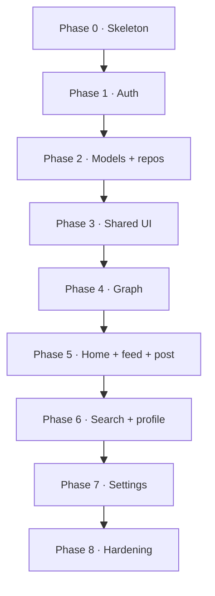

# Android Rewrite Order

Ordered plan to port `BubblerApp/` (SwiftUI) into `BubblerAndroid/` (Kotlin +
Jetpack Compose) inside this monorepo. **Backend is unchanged**; share
[`api_contracts.md`](api_contracts.md) and [`architecture.md`](architecture.md).

File layout target: [`android_filemap.md`](android_filemap.md).

Port from the **working iOS client**, not from any prior Flutter experiment. Match
behavior first; Compose visuals can converge toward Material 3 while preserving
Bubbler graph/bubble UX.

---

## Principles

1. **Bottom-up:** config → network/auth → models/repos → shared UI → graph core →
   remaining features → settings polish.
2. **One vertical slice early:** auth + restore session proves TokenStore and
   `ApiClient` before building every repository.
3. **Graph before settings:** the product differentiator is the graph walk; account
   forms can wait until discovery works.
4. **No backend forks:** if Android needs a contract change, update FastAPI + docs
   once for both clients.
5. **Exit criteria per phase:** do not start the next phase until the phase exit
   checklist passes against a seeded local backend.

---

## Phase 0 — Project skeleton

**Goal:** Empty Compose app builds and can hit the health endpoint.

| Order | Create | Notes |
| --- | --- | --- |
| 0.1 | `BubblerAndroid/` Gradle project + `app` module | namespace `com.bubbler.android` |
| 0.2 | `MainActivity.kt` + `app/BubblerApp.kt` + `app/theme/*` | Material 3 shell |
| 0.3 | `core/config/ApiConfig.kt` | Emulator: `http://10.0.2.2:8000`; device: LAN IP |
| 0.4 | Debug `network_security_config.xml` | Cleartext only in debug |
| 0.5 | `core/network/ApiClient.kt` + `ApiException.kt` + `Endpoints.kt` | Thin transport |
| 0.6 | Smoke call `GET /health` (or existing system health) | Proves connectivity |

**Exit:** App launches on emulator; health request succeeds against local `backend/`.

---

## Phase 1 — Auth + secure storage + session gate

**Goal:** Register, login, restore, sign-out—same OAuth2 password flow as iOS.

| Order | Create | Replaces |
| --- | --- | --- |
| 1.1 | `core/auth/TokenStore.kt` | `KeychainStore.swift` |
| 1.2 | `data/model/User.kt` | `User.swift` + `PublicUser.swift` |
| 1.3 | `data/repository/AuthRepository.kt` | `login` / `register` on `APIClient` |
| 1.4 | `core/auth/AuthSession.kt` | `AuthSession.swift` |
| 1.5 | `features/auth/components/AuthFormFields.kt` | Shared Login/CreateAccount fields |
| 1.6 | `features/auth/LoginScreen.kt` | `LoginView.swift` |
| 1.7 | `features/auth/CreateAccountScreen.kt` | `CreateAccountView.swift` (DOB day string + age gate) |
| 1.8 | Auth gate in `BubblerApp.kt` / `BubblerNavHost.kt` | `ContentView.swift` |

**Watch-outs:** OAuth2 password form uses `username` = email; DOB is a calendar date
string (`YYYY-MM-DD`), not a UTC instant. Fold former `BackendConnection` into
`ApiClient.health()`—no separate file.

**Exit:** Register → login → kill process → cold start still authenticated; sign-out
clears encrypted token storage.

---

## Phase 2 — Domain models + remaining repositories

**Goal:** Full HTTP surface available to UI before building screens.

| Order | Create | Replaces |
| --- | --- | --- |
| 2.1 | `data/model/Post.kt` | `Post.swift` |
| 2.2 | `data/model/Interaction.kt` | `Interaction.swift` |
| 2.3 | `data/model/Graph.kt` | `GraphFeedNode.swift` (+ session/payload types) |
| 2.4 | `data/model/Preferences.kt` | `UserPreferences.swift` |
| 2.5 | `data/model/Search.kt` | `SearchResponse.swift` |
| 2.6 | `data/model/Topics.kt` | `KnownTopics.swift` + `TopicPreferenceList.swift` |
| 2.7 | `data/model/BlockedUser.kt` | `BlockedUser.swift` |
| 2.8 | `data/repository/FeedRepository.kt` | `getFeed`, `getSessionFeed` |
| 2.9 | `data/repository/GraphRepository.kt` | `getNextGraphPosts` |
| 2.10 | `data/repository/PostRepository.kt` | create/update/delete/topic mutations |
| 2.11 | `data/repository/SearchRepository.kt` | `search` |
| 2.12 | `data/repository/UserRepository.kt` | profile, posts, interactions, likes, delete account |
| 2.13 | `data/repository/PreferencesRepository.kt` | get/update preferences |
| 2.14 | `data/repository/BlocksRepository.kt` | list/block/unblock |
| 2.15 | `core/storage/LikedPostsStore.kt` | `LikedPostsStore.swift` |

**Exit:** Unit tests decode representative JSON for each model; repositories compile
against `ApiClient`. Prefer model tests here—graph UI comes next.

---

## Phase 3 — Shared UI primitives

**Goal:** Reusable Compose components before feature screens (avoids forking post cards).

| Order | Create | Replaces |
| --- | --- | --- |
| 3.1 | `ui/theme/TopicStyle.kt` | `TopicStyle` inside `TopicPicker.swift` |
| 3.2 | `ui/components/BubblerLogo.kt` | `BubblerLogoView.swift` |
| 3.3 | `ui/components/TopicPicker.kt` | `TopicPicker.swift` |
| 3.4 | `ui/components/PreferenceSliderRow.kt` | `PreferenceSliderRow.swift` |
| 3.5 | `ui/components/PreferenceTopicsEditor.kt` | `PreferenceTopicsEditor.swift` |
| 3.6 | `ui/components/StatusBanner.kt` | Inline banners in `GraphFeedView` |
| 3.7 | `ui/components/AsyncBody.kt` | Repeated loading/empty/error cards |
| 3.8 | `ui/components/PostCard.kt` | `PostCardView.swift` |

Wire `PostCard` to repositories for like/skip/edit/delete only as far as needed for
compile; full interaction paths land with graph/feed.

**Exit:** A debug gallery screen (or Compose Preview group) can show logo, topic
picker, and a sample post card.

---

## Phase 4 — Graph feed (product core)

**Goal:** Parity with session walk, ≤4 bubbles, skip, diversify, interactions.

| Order | Create | Replaces |
| --- | --- | --- |
| 4.1 | `features/graph/components/NeighborBubble.kt` | `GraphNeighborBubble` |
| 4.2 | `features/graph/components/BubbleField.kt` | Polar layout / `bubbleAngle` in `GraphFeedView` |
| 4.3 | `features/graph/GraphFeedViewModel.kt` | `GraphFeedViewModel.swift` (**hardest logic**) |
| 4.4 | `features/graph/GraphFeedScreen.kt` | `GraphFeedView.swift` |
| 4.5 | Tests under `app/src/test/.../graph/` | Documented retry / queue / diversify rules |

**Must match architecture:** up to three session retries; force diversify after first
failure; session queue fallback when a node has no neighbors; view-time on advance;
client-side preferred/blacklist flag refresh on choices.

**Exit:** Manual walk against seeded backend matches Swift behavior for explore,
select, skip, empty-neighbor escape, and preference chips on `PostCard`.

---

## Phase 5 — Home shell + ranked feed + create post

**Goal:** Main navigation and the non-graph discovery path.

| Order | Create | Replaces |
| --- | --- | --- |
| 5.1 | `app/navigation/Routes.kt` + `BubblerNavHost.kt` (if not done in Phase 1) | Navigation stacks |
| 5.2 | `features/home/MainTabScreen.kt` | `MainTabView.swift` tabs |
| 5.3 | `features/home/FeedTabScreen.kt` | Graph ↔ ranked toggle + Create Post toolbar |
| 5.4 | `features/feed/RankedFeedViewModel.kt` | `FeedViewModel.swift` |
| 5.5 | `features/feed/RankedFeedScreen.kt` | `FeedView.swift` |
| 5.6 | `features/post/CreatePostViewModel.kt` | `CreatePostViewModel.swift` |
| 5.7 | `features/post/CreatePostScreen.kt` | `CreatePostView.swift` |

**Exit:** Tab bar works; toggle switches graph/ranked; create post appears in
feed/graph after refresh.

---

## Phase 6 — Search + profile

**Goal:** Discovery and identity surfaces.

| Order | Create | Replaces |
| --- | --- | --- |
| 6.1 | `features/search/SearchViewModel.kt` | `SearchViewModel.swift` |
| 6.2 | `features/search/SearchScreen.kt` | `SearchView.swift` |
| 6.3 | `features/profile/ProfileViewModel.kt` | `ProfileViewModel.swift` (+ public fetch) |
| 6.4 | `features/profile/BubbleTrail.kt` | `BubbleTrailView.swift` |
| 6.5 | `features/profile/MyProfileScreen.kt` | `ProfileView.swift` |
| 6.6 | `features/profile/UserProfileScreen.kt` | `UserProfileView.swift` |

**Exit:** Hybrid search returns exact + related; own profile shows posts + trail;
public profile + block entry points work with auth.

---

## Phase 7 — Settings

**Goal:** Account, recommendation prefs, blocks. Uses consolidated account ViewModel
from the file map.

| Order | Create | Replaces |
| --- | --- | --- |
| 7.1 | `features/settings/SettingsScreen.kt` | `SettingsView.swift` |
| 7.2 | `features/settings/account/AccountViewModel.kt` | Email + Password + ProfileInfo + DeleteAccount **ViewModels** |
| 7.3 | `features/settings/account/ProfileInfoScreen.kt` | `ProfileInformationView.swift` |
| 7.4 | `features/settings/account/EmailSettingsScreen.kt` | `EmailSettingsView.swift` |
| 7.5 | `features/settings/account/PasswordSecurityScreen.kt` | `PasswordSecurityView.swift` |
| 7.6 | `features/settings/account/DeleteAccountScreen.kt` | `DeleteAccountView.swift` |
| 7.7 | `features/settings/preferences/PreferencesViewModel.kt` | `PreferencesSettingsViewModel.swift` |
| 7.8 | `features/settings/preferences/PreferencesScreen.kt` | `PreferencesSettingsView.swift` |
| 7.9 | `features/settings/blocks/BlocksViewModel.kt` | `BlockedViewModel.swift` |
| 7.10 | `features/settings/blocks/BlockedUsersScreen.kt` | `BlockedView.swift` |

Normalize strategy weights the same way as iOS before `PUT` preferences.

**Exit:** Full settings parity; delete account signs out; blocks list round-trips.

---

## Phase 8 — Hardening (keep iOS)

| Order | Work |
| --- | --- |
| 8.1 | End-to-end checklist vs Swift on same backend seed |
| 8.2 | Release network config (no cleartext); Play Data Safety form |
| 8.3 | ProGuard/R8 keep rules for kotlinx.serialization (if used) |
| 8.4 | Document emulator vs device base URL in `BubblerAndroid/README.md` |

Unlike a cross-platform rewrite that retires Swift, **keep `BubblerApp/`**. Android
is a parallel client. Launch/legal items in [`roadmap.md`](roadmap.md) (report flow,
privacy labels, etc.) remain product work on both clients—not a substitute for these
phases.

---

## Summary sequence

```text
0 Skeleton + health check
1 Auth + secure storage + ApiClient
2 Models + repositories + liked-posts store
3 Shared Compose widgets (esp. PostCard, topic style)
4 Graph ViewModel + bubble UI          ← highest risk
5 Home shell + ranked feed + create post
6 Search + profile
7 Settings (account consolidated, prefs, blocks)
8 Hardening (Play / release networking)
```

---

## Suggested dependency order (why this sequence)



Phases 5–7 can partially overlap after Phase 4 if two people work in parallel (e.g.
search while someone finishes ranked feed), but **do not** start Phase 4 until
repositories and `PostCard` exist.

---

## Media and the port calculus

**Media is the first feature that changes the port calculus for Android.**

Today’s port is favorable because the client is a thin HTTP/JSON UI: no camera,
photo library, uploads, or object storage. The `media` table in `schema.sql` is a
stub; there are no upload routes. Phases 0–8 assume that text-and-graph world.

When roadmap **F6 (media attachments)** ships, the calculus changes:

| Dimension | Text/graph Android (now) | With media (later) |
| --- | --- | --- |
| Stack boundary | Client port only | **Full stack**: upload API, storage, CDN/thumbnails, DB wiring |
| Android surface | Compose + custom bubble layout | CameraX / Photo Picker, permissions, compression, progress UI |
| Platform compliance | Networking + account data | Storage/media permissions; Play Data Safety refresh |
| Trust & safety | Report/moderation as today | CSAM hashing, re-DPIA, retention for binaries ([`privacy_legal.md`](privacy_legal.md), [`roadmap.md`](roadmap.md) F6) |
| File map | No `features/media/` | New feature package + repository methods; `PostCard` and create-post gain attachments |
| Risk to timeline | Predictable port of ~7.6k Swift LOC | Upload reliability, large payloads, and store review dominate over “translate SwiftUI” |

**Guidance:** Complete the Android port (Phases 0–8) **without** media. Treat media as
a planned multi-client feature: design backend upload contracts first, then add
`features/media/` and extend `PostCard` / create-post on iOS and Android together.
Do not invent an Android-only media path against the unused schema stub.

Other post-launch items (follows, bio, graph-local search) stay ordinary API + screen
work and do **not** change the calculus the way media does.
