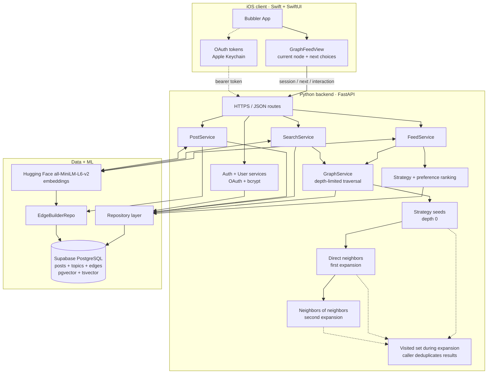

# System Architecture

Bubbler treats posts as a directed, typed graph. A post is a node; a persisted row in
`edges` is an outbound relationship to another post. The backend builds and ranks the
graph, while the SwiftUI client renders the current node and up to four possible hops.

## System and graph request flow



There are two related recommendation paths:

- The ranked feed (`GET /feed/me`) collects strategy-specific seeds, expands their
  persisted neighbors, and ranks the combined candidate set.
- The graph feed starts a session with `GET /feed/me/session`, then requests the current
  post's choices with `GET /graph/posts/{post_id}/next`. The user explicitly chooses a
  neighbor, or the client advances through the remaining choices/session queue.

## Post graph model

The `edges` table stores `from_post_id`, `to_post_id`, `edge_type`, and `weight`.
Edges are directed and unique per `(from, to, type)`, so two posts may have more than
one relationship and reverse traversal is not implied. Deleting either post removes
the edge through foreign-key cascades.

Each post can have four persisted outbound edge types:

- `similar`: one of the nearest posts by pgvector cosine distance.
- `opposite`: one of the farthest posts by cosine distance.
- `topic`: a post sharing a topic. Its fixed weight is `0.55`, deliberately below
  typical strong semantic matches so topic-only links do not dominate.
- `bridge`: a semantically close post whose primary topic differs from the source.

`random` is a selection strategy, not a persisted edge type. Random candidates are
sampled at request time with PostgreSQL `TABLESAMPLE`.

The primary topic exposed to feed logic comes from `posts_with_topic`, which selects
the highest-weight topic attached to each post. A post may have additional topics, but
diversity checks and most preference scoring use this single primary topic.

### Edge lifecycle

When a post is created, MiniLM produces its embedding and `EdgeBuilderRepo` finds up to
five targets for each edge type. When post content is edited, all of that post's
outbound edges are deleted and rebuilt from the new embedding. Incoming edges from
other posts are unchanged until those source posts are rebuilt. Adding or removing a
topic currently does not trigger an edge rebuild.

## Candidate strategies

Users control four non-negative strategy weights. Defaults are:

```text
similar = 0.40
graph   = 0.25
opposite = 0.20
random  = 0.15
```

The iOS model clamps each value to `[0, 1]` and normalizes the group before saving.
The backend uses the saved values both to score candidates and to allocate limited
candidate slots:

- `similar` favors high cosine similarity.
- `graph` favors graph-native `topic` and `bridge` relationships. In ranked-feed seed
  generation, a positive graph weight also uses nearby semantic posts as traversal
  seeds so graph expansion has a starting frontier.
- `opposite` favors low cosine similarity.
- `random` contributes sampled posts with a neutral base relevance of `0.5`.

For a strategy candidate, the base score is approximately:

```text
strategy score = strategy weight × relevance

similar/graph relevance = max(similarity, 0)
opposite relevance      = (1 - similarity) / 2
random relevance        = 0.5
```

Weights therefore affect both representation (quota allocation) and order (score);
they are not merely UI labels or post-ranking multipliers.

## Preferences layered onto the graph

Candidate strategy establishes a base score. User preferences then modify eligibility
and ordering:

1. Blacklisted primary topics are removed.
2. Preferred primary topics receive `+0.3`.
3. If view-time learning is enabled, recent seconds per topic are aggregated with
   `log1p`, normalized against the strongest topic, and capped by
   `0.3 × view_time_weight`.
4. If recency is enabled, a post receives `0.3 / (1 + age_in_days)`.
5. Randomness adds bounded jitter:
   `random(0...1) × randomness × 0.15`.

Randomness changes ordering within the candidate pool; the random strategy changes
which posts enter the pool. These are separate controls.

The client also re-applies blacklist filtering and promotes preferred-topic posts while
preserving the backend order among otherwise equal choices. This protects the graph UI
from stale preference state, but the backend remains the authoritative selector.

## Neighbor selection for the graph feed

For `GET /graph/posts/{post_id}/next`, the backend:

1. Loads up to eight outbound edges per persisted edge type.
2. Maps edge types to user strategies: `topic`/`bridge` to `graph`, `similar` to
   `similar`, and `opposite` to `opposite`.
3. Optionally adds eight request-time random candidates when random weight is positive.
4. Scores edges using their weight, strategy weight, preference bonuses, recency, and
   bounded jitter. `bridge`, `opposite`, and `similar` also receive small type bonuses;
   cross-topic hops receive a novelty bonus.
5. Allocates the four visible slots with weighted quotas, then fills unused slots with
   the highest-scoring leftovers.

Diversity tolerance limits same-topic hops from the current post:

- `0...1/3`: reserve up to two topic-edge slots and allow at most three same-topic posts.
- Between `1/3` and `2/3`: reserve one topic-edge slot and allow at most two.
- `2/3...1`: reserve no topic-edge slots and allow at most one.

Quotas are best-effort. If one edge type has too few candidates, globally ranked
leftovers fill the remaining slots while still respecting the same-topic cap.

## Session seeding and escape behavior

A graph session returns six posts before the user starts choosing neighbors. The
backend caches, per user and UTC day, the embedding and topic of one post liked
yesterday:

- With a prior like, a normal session uses it as a soft similarity target and mixes in
  random posts. The target similarity is `1 - diversity_tolerance`.
- Without a prior like, the session starts from random candidates.
- A diversify request excludes the liked topic, mixes opposite, target-similarity, and
  random candidates, and applies the strictest per-topic cap.

Blacklisted topics are excluded before ranking. Preferred topics, view time, recency,
and randomness then rank the session candidates. Diversity tolerance caps a six-post
session at three, two, or one post per topic. If a candidate source is empty, the
repository falls back to random posts while preserving blacklist filtering.

The client retries an unusable session up to three times and forces diversification
after the first attempt. It keeps the first post as the current node and the rest as a
fallback queue. If a current node has no usable neighbors, skip/advance consumes the
queue; an empty queue starts a diversified session.

## Traversal and “DFS”

`GraphService.expand_posts` is the shared depth-limited graph expansion used by the
ranked feed and hybrid search. It keeps a `visited` set, batches neighbor queries for a
frontier, follows at most four highest-weight outbound neighbors per source, and avoids
expanding a node twice.

Although this logic is commonly described in the project as DFS, the implementation
recurses once per complete frontier, so its visit order is breadth-by-level rather than
classic stack-based depth-first order. Its `depth` parameter is also inclusive:

- `depth=0` fetches direct neighbors only (used by search).
- The default `depth=1` fetches direct neighbors and then their neighbors (used by the
  ranked feed).

Expansion can emit duplicate result IDs when different paths reach the same node;
callers convert IDs to a set or otherwise deduplicate before returning posts.

## Client walk and feedback loop

`GraphFeedViewModel` maintains:

- `currentNode`: the post being viewed.
- `nextChoices`: ranked neighbors shown as bubbles.
- `sessionQueue`: session posts used when automatic advancement has no neighbor.
- `currentPostStartedAt`: the basis for recorded view time.

Choosing a bubble records `explore` for the old current post and makes the chosen
neighbor current. Skipping records `skip` and takes the first usable neighbor, then a
session fallback. Likes, explores, skips, and view time are stored as interactions;
view time influences later topic boosts, and yesterday's like can seed the next day's
session. Blacklisting the current topic records a skip, clears local choices, and
immediately requests a diversified session.

## Relevant implementation files

- `backend/app/repositories/edge_builder_repo.py`: constructs typed outbound edges.
- `backend/app/repositories/feed_repo.py`: vector candidates, neighbor queries, random
  sampling, and session candidate retrieval.
- `backend/app/services/graph.py`: depth-limited batched traversal.
- `backend/app/services/feed.py`: strategies, preferences, ranking, quotas, and graph
  session/next-post orchestration.
- `BubblerApp/BubblerApp/Features/Graph/GraphFeedViewModel.swift`: client-side graph
  walk, queue fallback, preference synchronization, and interaction recording.
