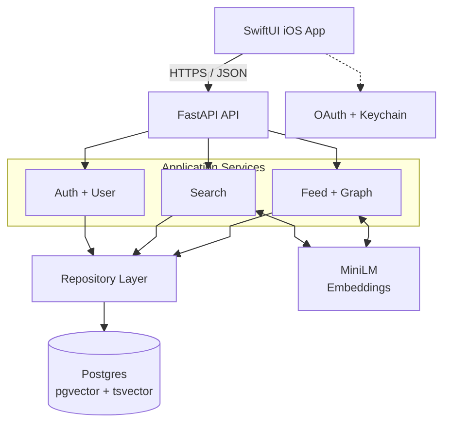

# System Architecture

The iOS client calls the FastAPI backend, whose services contain the application logic.
Repositories isolate database access, while MiniLM embeddings and PostgreSQL extensions
support recommendation, graph traversal, and hybrid search.
