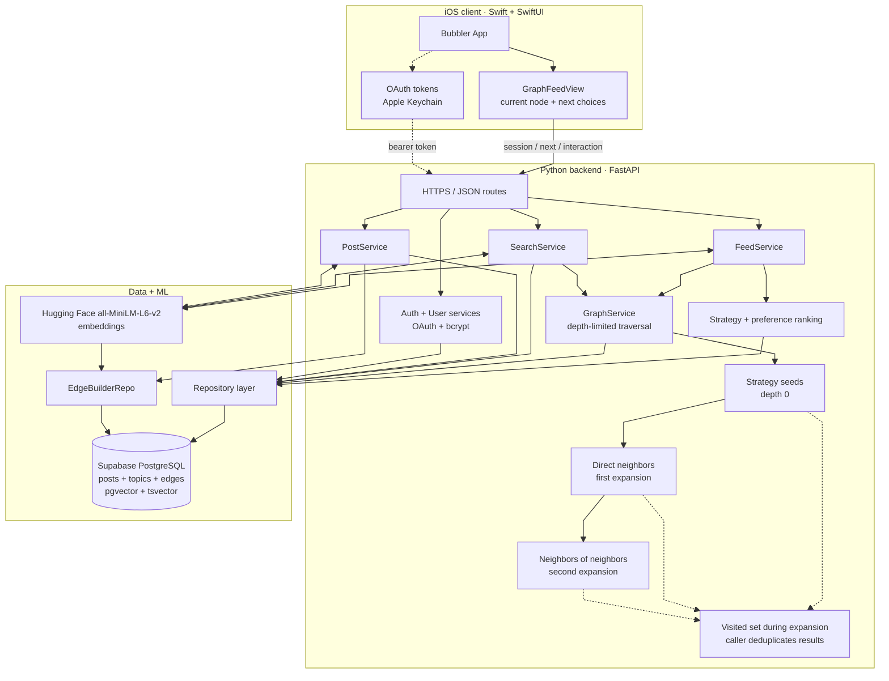

# System Architecture

Bubbler treats posts as a directed, typed graph. A post is a node; a persisted row in
`edges` is an outbound relationship to another post. The backend builds and ranks the
graph, while the SwiftUI client renders the current node and up to four possible hops.

## System and graph request flow


```mermaid
%%{init: {"flowchart": {"curve": "linear", "nodeSpacing": 22, "rankSpacing": 30}, "themeVariables": {"fontSize": "12px"}}}%%
flowchart TB
    subgraph Client["iOS client · Swift + SwiftUI"]
        App["Bubbler App"]
        GraphUI["GraphFeedView<br/>current node + next choices"]
        Keychain["OAuth tokens<br/>Apple Keychain"]
        App --> GraphUI
        App -.-> Keychain
    end

    subgraph Backend["Python backend · FastAPI"]
        API["HTTPS / JSON routes"]
        Feed["FeedService"]
        Search["SearchService"]
        Posts["PostService"]
        Account["Auth + User services<br/>OAuth + bcrypt"]
        Strategy["Strategy + preference ranking"]
        Traversal["GraphService<br/>depth-limited traversal"]
        Frontier0["Strategy seeds<br/>depth 0"]
        Frontier1["Direct neighbors<br/>first expansion"]
        Frontier2["Neighbors of neighbors<br/>second expansion"]
        Dedupe["Visited set during expansion<br/>caller deduplicates results"]

        API --> Feed
        API --> Search
        API --> Posts
        API --> Account
        Feed --> Strategy
        Feed --> Traversal
        Search --> Traversal
        Traversal --> Frontier0
        Frontier0 --> Frontier1
        Frontier1 --> Frontier2
        Frontier0 -.-> Dedupe
        Frontier1 -.-> Dedupe
        Frontier2 -.-> Dedupe
    end

    subgraph Data["Data + ML"]
        Repos["Repository layer"]
        EdgeBuilder["EdgeBuilderRepo"]
        DB[("Supabase PostgreSQL<br/>posts + topics + edges<br/>pgvector + tsvector")]
        ML["Hugging Face all-MiniLM-L6-v2<br/>embeddings"]

        Repos --> DB
        EdgeBuilder --> DB
        ML --> EdgeBuilder
    end

    GraphUI -->|"session / next / interaction"| API
    Keychain -.->|"bearer token"| API
    Strategy --> Repos
    Traversal --> Repos
    Search --> Repos
    Posts --> Repos
    Account --> Repos
    Posts --> EdgeBuilder
    Feed <--> ML
    Search <--> ML
    Posts <--> ML
```

There are two related recommendation paths:

- The ranked feed (`GET /feed/me`) collects strategy-specific seeds, expands their
  persisted neighbors, and ranks the combined candidate set.
- The graph feed starts a session with `GET /feed/me/session`, then requests the current
  post's choices with `GET /graph/posts/{post_id}/next`. The user explicitly chooses a
  neighbor, or the client advances through the remaining choices/session queue.

## Post graph model

The `edges` table stores `from_post_id`, `to_post_id`, `edge_type`, and `weight`.
Edges are directed and unique per `(from, to, type)`, so two posts may have more than
one relationship and reverse traversal is not implied. Deleting either post removes
the edge through foreign-key cascades.

Each post can have four persisted outbound edge types:

- `similar`: one of the nearest posts by pgvector cosine distance.
- `opposite`: one of the farthest posts by cosine distance.
- `topic`: a post sharing a topic. Its fixed weight is `0.55`, deliberately below
  typical strong semantic matches so topic-only links do not dominate.
- `bridge`: a semantically close post whose primary topic differs from the source.

`random` is a selection strategy, not a persisted edge type. Random candidates are
sampled at request time with PostgreSQL `TABLESAMPLE`.

The primary topic exposed to feed logic comes from `posts_with_topic`, which selects
the highest-weight topic attached to each post. A post may have additional topics, but
diversity checks and most preference scoring use this single primary topic.

### Edge lifecycle

When a post is created, MiniLM produces its embedding and `EdgeBuilderRepo` finds up to
five targets for each edge type. When post content is edited, all of that post's
outbound edges are deleted and rebuilt from the new embedding. Incoming edges from
other posts are unchanged until those source posts are rebuilt. Adding or removing a
topic currently does not trigger an edge rebuild.

## Two-tier feed composition

Users control exploration through **topic composition** and **post composition**, each with three normalized weights (`similar`, `opposite`, `surprise`). Defaults match the `stay_in_lane` preset:

```text
similar  = 0.55
opposite = 0.15
surprise = 0.30
```

Presets (`stay_in_lane`, `cross_pollinate`, `wild_walk`) set both tiers; `custom` preserves Advanced slider values.

### New account defaults

Registration persists a `user_profiles` row in the same transaction as the new user. Defaults match the **`stay_in_lane`** preset with behavioral toggles off:

| Field | Default |
| --- | --- |
| `feed_preset` | `stay_in_lane` |
| `topic_composition` / `post_composition` | `similar=0.55`, `opposite=0.15`, `surprise=0.30` |
| `topic_preferences` | *(empty — no preferred or blacklisted topics)* |
| `use_recency` | `false` |
| `use_view_time` | `false` |
| `ai_topic_detection` | `false` |

There is **no platform-seeded topic blacklist** at launch (may change as topics grow). Users may prefer or blacklist topics from account creation; all settings remain editable in Settings immediately. A future **Strict / Balanced / Open** sensitivity slider (roadmap F11) is a separate control—not the same as `stay_in_lane`.

Policy detail: [`moderation.md`](moderation.md) § Default protections.

The backend selects candidates in two stages:

1. **Topic tier** — using `topics.embedding`, pick topic buckets (same/near, distant, random).
2. **Post tier** — within each topic, pick posts by embedding similarity, embedding contrast, or random sample. Post **similar** also merges outbound graph neighbors (`similar`, `topic`, `bridge`).

Surprise at the topic tier replaces legacy diversity caps; surprise at the post tier replaces legacy randomness jitter and the random strategy pool.

## Preferences layered onto the graph

Composition establishes candidate pools and base scores. User preferences then modify eligibility and ordering:

1. Blacklisted primary topics are removed.
2. Preferred primary topics receive `+0.3`.
3. If view-time learning is enabled, recent seconds per topic are aggregated with
   `log1p`, normalized against the strongest topic, and capped by
   `0.3 × view_time_weight`.
4. If recency is enabled, a post receives `0.3 / (1 + age_in_days)`.

The client also re-applies blacklist filtering and promotes preferred-topic posts while
preserving the backend order among otherwise equal choices.

## Neighbor selection for the graph feed

For `GET /graph/posts/{post_id}/next`, the backend:

1. Runs `TopicComposer` from the current post's primary topic.
2. Runs `PostComposer` per selected topic using the anchor post embedding.
3. Applies preference bonuses and recency, then ranks candidates.
4. Allocates four visible slots using post-composition quotas and a same-topic cap derived from topic composition.

## Session seeding and escape behavior

A graph session returns six posts before the user starts choosing neighbors. The backend uses two-tier composition seeded from recent positive feed preferences when available. `?diversify=true` forces a high topic-surprise mix to escape stale regions.

Blacklisted topics are excluded before ranking. Preferred topics, view time, and recency then rank session candidates. Topic surprise controls per-topic spread in the six-post session. If candidate pools are empty, the service falls back to random posts while preserving blacklist filtering.

The client retries an unusable session up to three times and forces diversification
after the first attempt. It keeps the first post as the current node and the rest as a
fallback queue. If a current node has no usable neighbors, skip/advance consumes the
queue; an empty queue starts a diversified session.

## Traversal and “DFS”

`GraphService.expand_posts` is the shared depth-limited graph expansion used by the
ranked feed and hybrid search. It keeps a `visited` set, batches neighbor queries for a
frontier, follows at most four highest-weight outbound neighbors per source, and avoids
expanding a node twice.

Although this logic is commonly described in the project as DFS, the implementation
recurses once per complete frontier, so its visit order is breadth-by-level rather than
classic stack-based depth-first order. Its `depth` parameter is also inclusive:

- `depth=0` fetches direct neighbors only (used by search).
- The default `depth=1` fetches direct neighbors and then their neighbors (used by the
  ranked feed).

Expansion can emit duplicate result IDs when different paths reach the same node;
callers convert IDs to a set or otherwise deduplicate before returning posts.

## Client walk and feedback loop

`GraphFeedViewModel` maintains:

- `currentNode`: the post being viewed.
- `nextChoices`: ranked neighbors shown as bubbles.
- `sessionQueue`: session posts used when automatic advancement has no neighbor.
- `currentPostStartedAt`: the basis for recorded view time.

Choosing a bubble records `explore` for the old current post and makes the chosen
neighbor current. Skipping records `skip` and takes the first usable neighbor, then a
session fallback. Feed-preference sliders, explores, skips, and view time are stored as
interactions; view time influences later topic boosts, and recent positive feed
preferences can seed the next session. Blacklisting the current topic records a skip,
clears local choices, and immediately requests a diversified session.

## Relevant implementation files

- `backend/app/repositories/edge_builder_repo.py`: constructs typed outbound edges.
- `backend/app/repositories/feed_repo.py`: vector candidates, neighbor queries, random
  sampling, and session candidate retrieval.
- `backend/app/services/graph.py`: depth-limited batched traversal.
- `backend/app/services/topic_composer.py`: topic-tier selection via `topics.embedding`.
- `backend/app/services/post_composer.py`: post-tier selection within topics.
- `backend/app/services/feed.py`: composition, preferences, ranking, and graph
  session/next-post orchestration.
- `BubblerApp/BubblerApp/Features/Graph/GraphFeedViewModel.swift`: client-side graph
  walk, queue fallback, preference synchronization, and interaction recording.
