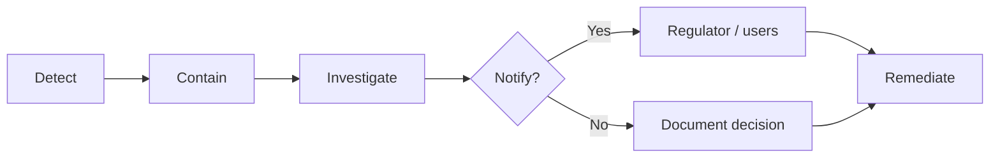

# Personal Data Breach Playbook

Internal incident response plan for Bubbler. **Not legal advice** — counsel must review severity thresholds, notification obligations, and template wording before production.

Related: [`privacy_legal.md`](privacy_legal.md) §12, [`retention.md`](retention.md), [`roadmap.md`](roadmap.md) L10, [`architecture.md`](architecture.md).

**Audience:** incident lead, eng on-call, counsel/DPO-equivalent, trust & safety (when moderation data is in scope).

**Launch posture:** EU and California in market. GDPR Art. 33–34 and US state breach-notification laws may apply depending on scope and risk.

---

## 1. Scope

### 1.1 What counts as a breach

A **personal data breach** is a breach of security leading to accidental or unlawful **destruction, loss, alteration, unauthorized disclosure of, or access to** personal data.

Includes:

- Database or backup exposure (misconfigured Supabase, stolen credentials, public dump).
- Compromised backend secrets (`SECRETKEY`, `DATABASE_PASSWORD`).
- Unauthorized staff or third-party access to user records.
- Accidental publication of user data (logs, exports, support tickets).
- Ransomware or destructive access to production data.

Usually **not** a platform breach (handle via normal support):

- Single-user credential stuffing where the platform was not at fault.
- User device compromise (Keychain/Keystore token theft on one device) without backend compromise.

### 1.2 Personal data inventory

| Category | Location | Notes |
| --- | --- | --- |
| Account identity | `users` | username, email, bcrypt password hash, `date_of_birth`, `role` |
| Deleted-account identity | `deleted_accounts` | tombstone up to 90 days; no password hash |
| Profile / prefs | `user_profiles`, `user_topic_prefs` | display settings, topic preferences |
| UGC | `posts`, `post_topics`, `edges` | post text, topic labels, graph edges |
| Embeddings | `posts.embedding`, `topics.embedding` | derived from content; treat as personal if linkable to users |
| Interactions | `interactions` | feed preferences (-2..+2), explore/skip, optional `view_time` |
| Training events | `topic_training_events` | anonymized after 180 days (`user_id` cleared) |
| Social controls | `user_blocks` | blocker / blocked user IDs |
| Moderation | `content_reports` | reporter/reported user IDs, snapshots, staff notes |
| Rate limits | `reporter_daily_limits`, `user_report_limits`, `user_data_export_limits` | user IDs + day counters |
| Sessions | JWT in client Keychain/Keystore | HS256 signed with `SECRETKEY`; default TTL 168 h (`TIMEOFFSET`) |
| Logs | Hosting log sink | access/error logs; target 90 days ([`retention.md`](retention.md)) |
| Backups | Supabase PITR / backups | target 30 days; may contain erased users |

Future (update this section when shipped):

- **F1** transactional email — provider may hold addresses and message metadata.
- **F6** media object storage — blobs keyed by `media.storage_key`.

### 1.3 Systems in scope

| System | Provider / component | Secrets / access |
| --- | --- | --- |
| PostgreSQL | Supabase | `DATABASE`, `DB_USER`, `DATABASE_PASSWORD`, `HOST`, `PORT` |
| API backend | FastAPI (`backend/`) | `SECRETKEY`, `ALGORITHM`, deploy env |
| iOS client | `BubblerApp/` | OAuth/session token in Keychain only |
| Android client | `BubblerAndroid/` | session token in Keystore only |
| ML inference | Hugging Face `all-MiniLM-L6-v2` | post content sent for embedding at write/search time |
| Scheduled jobs | `scripts/run_retention.py` | DB credentials; can delete/anonymize rows |

Store live credentials in a password manager or host secret store — **not** in this document.

### 1.4 Related runbooks (do not duplicate)

| Topic | Doc / roadmap |
| --- | --- |
| CSAM / NCMEC | [`privacy_legal.md`](privacy_legal.md) §19 · L11 |
| DMCA | [`privacy_legal.md`](privacy_legal.md) §20 · L11 |
| Law-enforcement requests | [`privacy_legal.md`](privacy_legal.md) §21 · L11 |
| Retention / legal hold | [`retention.md`](retention.md) |

If a breach involves CSAM or illegal content, follow the CSAM runbook for handling material (no redistribution) **in parallel** with this playbook.

---

## 2. Roles and contacts

Fill before public launch. Keep a break-glass copy outside production (password manager, printed card in secure location).

| Role | Name | Contact | Responsibilities |
| --- | --- | --- | --- |
| **Incident lead** | _TBD_ | _TBD_ | Declares incident, owns timeline, coordinates phases |
| **Eng on-call** | _TBD_ | _TBD_ | Contain, rotate secrets, forensics, preserve logs |
| **Counsel / DPO** | _TBD_ | _TBD_ | Notification decisions, regulator/user wording, jurisdiction |
| **Comms** | _TBD_ | _TBD_ | User notice, status page, press if needed |
| **Trust & safety** | _TBD_ | _TBD_ | Moderation data scope, legal hold on reports |

### Vendor escalation

| Vendor | Purpose | Support contact |
| --- | --- | --- |
| Supabase | DB, backups, project access | _TBD — dashboard + support ticket_ |
| Hosting (API) | FastAPI deploy, logs | _TBD_ |
| Hugging Face | Model inference (if account/API key used) | _TBD_ |
| Future email provider | F1 | _TBD_ |

Record subprocessors in ROPA (roadmap L15).

---

## 3. Severity levels

Use the highest plausible severity until investigation narrows scope. **Counsel decides** notification obligations.

| Level | Examples | Target response |
| --- | --- | --- |
| **S1 — Critical** | Full DB or backup dump public; `SECRETKEY` + DB creds leaked; mass exfiltration of emails/password hashes | Contain within **1 hour**; counsel **same day**; assess GDPR **72 h** clock immediately |
| **S2 — High** | Staff account compromised; limited table exposure; misconfigured public bucket (future media); read access to production DB | Contain within **4 hours**; written assessment within **24 hours** |
| **S3 — Medium** | Short-lived exposure fixed before access confirmed; internal tool leaked non-production copy with subset of real data | Investigate within **24 hours**; document decision |
| **S4 — Low / near-miss** | Scanner hit with no auth bypass; dependency CVE with no evidence of exploit | Log, patch, review; no notification unless counsel advises |

### Awareness and the 72-hour clock (GDPR)

The GDPR Art. 33 regulator notification clock starts when the organization has a **reasonable degree of certainty** that a personal data breach has occurred — not when investigation finishes.

Document **time of awareness** on the incident record (see §8).

---

## 4. Incident phases



### 4.1 Detect

**Signals to monitor**

- Supabase security alerts, unusual query volume, new API keys.
- Hosting alerts: 5xx spikes, auth failures, egress anomalies.
- User reports: unexpected logout, unfamiliar activity, data appearing elsewhere.
- Dependency/CVE advisories for FastAPI, PyJWT, Postgres, client libs.
- Secrets in git history, public forks, paste sites (run periodic scans pre-launch).

**Where to look**

| Source | Retention | Limitations |
| --- | --- | --- |
| Hosting stdout/stderr | ~90 days target | Basic `logging` today; no request-id standard yet |
| Supabase dashboard / logs | Per project settings | Enable audit logging where available |
| Git history | Indefinite | `.env` commits, accidental dumps |
| `content_reports` / staff actions | Per [`retention.md`](retention.md) | Moderation audit trail depends on L7 completeness |

**Detect checklist**

- [ ] Confirm whether personal data was accessed, exfiltrated, or only exposed.
- [ ] Record first report time and who reported.
- [ ] Assign incident lead and open incident record (§8).
- [ ] Notify eng on-call and counsel per severity (S1/S2: immediate).

### 4.2 Contain

Goal: stop ongoing exposure before deep forensics. Prefer reversible steps first.

**Immediate actions (S1/S2)**

- [ ] **Rotate `SECRETKEY`** — redeploy backend; invalidates all outstanding JWTs (no per-token revocation today).
- [ ] **Rotate DB credentials** — Supabase dashboard → update `DATABASE_PASSWORD` → redeploy with new env.
- [ ] **Revoke compromised API keys** — Supabase, hosting, Hugging Face, any CI secrets.
- [ ] **Disable compromised accounts** — staff `users.role = 'staff'`; ban/suspend via moderation tooling if attacker user known.
- [ ] **Restrict DB network access** — Supabase: allow-list IPs if previously open.
- [ ] **Pause retention job** — stop scheduled `run_retention.py` until counsel clears (preserves evidence).
- [ ] **Set legal hold** — `PATCH` staff report legal hold (`/admin/reports/{id}/legal-hold`) and ensure affected `deleted_accounts.legal_hold` synced; block purges on involved rows.
- [ ] **Preserve logs** — export hosting logs before TTL expiry; snapshot relevant Supabase metrics.
- [ ] **Future media (F6)** — disable bucket public access; revoke signed URLs.

**Do not**

- Destroy evidence (avoid wiping disks, mass-deleting logs, or running retention purges during investigation).
- Notify users before counsel assesses scope (except where immediate user action is required to stop active harm — coordinate with counsel).

**Contain checklist**

- [ ] Exposure path closed (confirm with test access attempt).
- [ ] Secrets rotation complete and old secrets revoked.
- [ ] Retention job paused (if applicable).
- [ ] Legal hold applied to relevant reports/tombstones (if applicable).
- [ ] Containment time recorded on incident record.

### 4.3 Investigate

**Scope questions**

1. **When** did exposure start and end?
2. **What** data categories and tables were accessible?
3. **How many** data subjects (users, reporters, deleted-account tombstones)?
4. **Which jurisdictions** — EU users, California residents (launch scope)?
5. **Was data encrypted** at rest/in transit? Password hashes only (bcrypt) vs plaintext?
6. **Attacker access** — read-only vs write/delete?
7. **Backups** — could attacker access PITR or backup exports?

**Bubbler-specific scope notes**

- Erased users may still appear in `deleted_accounts` (90 days) and closed `content_reports` (730 days).
- `topic_training_events` may still have `user_id` for rows younger than 180 days.
- Export endpoint (`GET /user/me/export`) shape defines a reasonable “full account” bundle for impact assessment.
- Embeddings are derived data; include in assessment if tied to identifiable posts/users.

**Investigation checklist**

- [ ] Timeline documented (UTC).
- [ ] Affected tables and approximate row counts recorded.
- [ ] Affected user count estimated (live + tombstone + reporters as applicable).
- [ ] Root cause hypothesis documented.
- [ ] Forensic artifacts preserved (log exports, query audit, git commit SHAs).
- [ ] Counsel briefed with draft scope memo.

### 4.4 Notify

**Counsel decides** all external notifications. This section is an operational checklist, not legal guidance.

**Decision inputs**

| Factor | Lean toward notification |
| --- | --- |
| Credential exposure | Password hashes or email+password pairs exposed |
| Financial / identity risk | DOB, email, username combined for phishing |
| Volume | Large fraction of user base |
| Special categories | Not collected today; revisit if product changes |
| Mitigation | Rotation completed before known access |

**GDPR (EU data subjects)**

- **Art. 33** — notify supervisory authority within **72 hours** of awareness if breach likely to result in risk to rights and freedoms (unless unlikely).
- **Art. 34** — notify affected users without undue delay if **high** risk to rights and freedoms.
- Record authority contacted, reference number, and time sent.

**California (CPRA / breach notification)**

- Coordinate with counsel for statutory thresholds (encryption safe harbors, timing, content).
- Align with L20 CCPA notice commitments.

**User notice channels**

- Email to affected accounts (primary).
- In-app banner or forced re-auth after `SECRETKEY` rotation.
- Public status page or blog post if wide impact (counsel/comms approval).

**Notify checklist**

- [ ] Counsel signed off on notify / no-notify decision.
- [ ] Regulator notification sent within 72 h if required (record timestamp).
- [ ] User notice drafted, reviewed, sent (record timestamp and channel).
- [ ] Support/macros updated for inbound questions.
- [ ] Decision and rationale archived on incident record even if **no** notification.

### 4.5 Remediate

- [ ] Root cause fixed (code, config, process).
- [ ] Monitoring/detection improved (alerts, logging gaps closed).
- [ ] Secrets rotation verified; old credentials confirmed dead.
- [ ] Retention job re-enabled only after counsel clears holds.
- [ ] Post-incident review scheduled within **14 days** (§7).
- [ ] Playbook and ROPA updated if scope or vendors changed.

---

## 5. Technical procedures

### 5.1 Rotate `SECRETKEY` (JWT invalidation)

JWTs are HS256-signed (`ALGORITHM`); default lifetime **168 hours** (`TIMEOFFSET`). There is **no per-token denylist** — rotating the secret invalidates all sessions.

1. Generate a new cryptographically random `SECRETKEY`.
2. Update production env (hosting secret store); deploy backend.
3. Verify old tokens return 401 on a protected route.
4. Communicate forced re-login to users if incident warrants notice.
5. Document rotation time on incident record.

Reference: [`backend/.env.example`](../backend/.env.example), [`backend/app/services/auth.py`](../backend/app/services/auth.py), [`backend/app/deps.py`](../backend/app/deps.py).

### 5.2 Rotate database credentials

1. Supabase dashboard → Database settings → reset password.
2. Update `DATABASE_PASSWORD` in production env; redeploy.
3. Verify API health (`/health` or equivalent).
4. Revoke any leaked connection strings; check for orphaned connections.

### 5.3 Pause retention job

```bash
# Disable cron / scheduled task for run_retention.py on the host.
# Do not run manually until investigation closes.
```

Reference: [`backend/scripts/run_retention.py`](../backend/scripts/run_retention.py), [`docs/retention.md`](retention.md).

### 5.4 Legal hold during incident

- **Reports:** staff API `update_report_legal_hold` on affected `content_reports` (syncs `deleted_accounts.legal_hold` for linked users).
- **Tombstones:** hold prevents purge in `run_retention.py`.
- **Backups:** counsel may require extended retention — document Supabase snapshot/export; do not rely on PITR alone for long holds.

Reference: [`backend/app/routes/admin.py`](../backend/app/routes/admin.py), [`backend/app/repositories/report_repo.py`](../backend/app/repositories/report_repo.py).

### 5.5 Evidence export (investigation)

Minimum useful exports (counsel may request more):

- Hosting access logs for incident window.
- Supabase query/log exports if available.
- List of affected user IDs and data categories.
- Staff moderation actions on affected content (if relevant).
- Git history for config commits in incident window.

---

## 6. Logging and detection gaps (honest baseline)

Document current limits so tabletop and real incidents do not over-promise forensics.

| Capability | Status | Launch action |
| --- | --- | --- |
| Structured request logging | Partial — basic app logging | Add request IDs + auth failure metrics before launch if feasible |
| Staff action audit log | Roadmap L7 | Required for moderation traceability |
| Supabase audit log | Ops config | Enable and route to retained sink |
| Secret scanning | Not in CI | Add pre-commit or GitHub secret scanning |
| Automated breach detection | None | Rely on vendor alerts + manual reports initially |

Logging retention must follow [`retention.md`](retention.md) (`LOG_RETENTION_DAYS`, default 90).

---

## 7. Post-incident review

Within **14 days** of closure, incident lead runs a brief review:

1. Timeline vs playbook — what worked, what did not?
2. Time to contain and time to notify.
3. Logging/evidence gaps.
4. Action items with owners and dates.
5. Update this playbook, [`retention.md`](retention.md), and ROPA (L15) if needed.

Store review notes with the incident record (§8).

---

## 8. Incident record template

Copy for each incident (internal ticket, doc, or issue — **not** public).

```markdown
# Incident [ID] — [short title]

- **Status:** open | contained | closed
- **Severity:** S1 | S2 | S3 | S4
- **Incident lead:**
- **Opened:**
- **Awareness time (GDPR clock):** UTC
- **Contained:**
- **Closed:**

## Summary
[One paragraph]

## Data categories affected
- [ ] users  [ ] deleted_accounts  [ ] posts  [ ] interactions
- [ ] content_reports  [ ] other: ___

## Approximate data subjects affected
[number / method]

## Timeline (UTC)
| Time | Event |
| --- | --- |
| | |

## Root cause


## Notification
- Regulator: yes / no — authority, ref, time
- Users: yes / no — channel, time
- Counsel approver:

## Remediation actions
- [ ]

## Post-incident review
- Scheduled:
- Link:
```

---

## 9. Draft notification templates (counsel must approve)

### 9.1 User email (high-risk breach — draft)

> **Subject:** Important security notice about your Bubbler account
>
> We are writing to tell you about a security incident that may have affected your Bubbler account.
>
> **What happened:** [Brief factual description]
>
> **What information was involved:** [e.g. email address, username, date of birth, posts — be specific]
>
> **What we have done:** [e.g. secured systems, rotated credentials, investigated with external counsel]
>
> **What you can do:** [e.g. reset your password in Settings; be alert for phishing; contact privacy@…]
>
> We regret this occurred and are taking steps to reduce the risk of recurrence.
>
> [Company contact / privacy email]

### 9.2 Regulator notification skeleton (GDPR Art. 33 — draft)

Counsel will map to the correct authority (lead supervisory authority for EU operations).

1. Nature of the breach (categories and approximate number of data subjects/records).
2. DPO/contact details.
3. Likely consequences.
4. Measures taken or proposed (containment, mitigation, communication).

---

## 10. Tabletop exercise (required before launch)

Run **once** with incident lead, eng on-call, and counsel (or founder wearing counsel hat with external review scheduled).

**Suggested scenario:** `SECRETKEY` and a read-only Postgres connection string were committed to a public GitHub repository for 6 hours before discovery. A security researcher emailed a screenshot of `users` row counts.

**Exercise goals (90 minutes)**

1. Declare severity and awareness time.
2. Walk contain checklist (rotation, pause retention).
3. Scope affected data including `deleted_accounts` and `content_reports`.
4. Decide mock notify/no-notify within 72 h framing.
5. List logging gaps that blocked investigation.

**Record:** date, participants, gaps, playbook edits filed.

| Field | Value |
| --- | --- |
| Date | _TBD_ |
| Participants | _TBD_ |
| Gaps found | _TBD_ |
| Follow-up tasks | _TBD_ |

---

## 11. Maintenance

Review this playbook:

- After any real incident or tabletop.
- When adding subprocessors (L15), media (F6), or email (F1).
- After major auth or retention changes.
- At least **annually**.

**Public surface:** Privacy Policy (L1) should include a short commitment to assess incidents and notify users/regulators as required by law. Do not publish this internal playbook.

---

## 12. L10 completion checklist (breach half)

Scaffold status — mark when truly done:

- [x] Internal playbook document (this file)
- [ ] Contacts and vendor escalation filled in (§2)
- [ ] Counsel review of severity thresholds and templates (§3, §9)
- [ ] Secrets rotation tested in staging (§5.1–5.2)
- [ ] Retention pause + legal hold tested operationally (§5.3–5.4)
- [ ] Tabletop exercise completed and recorded (§10)
- [ ] Privacy Policy incident paragraph published (L1)
- [ ] Logging/detection gaps triaged with owners (§6)

See [`retention.md`](retention.md) for the retention-schedule half of L10.
