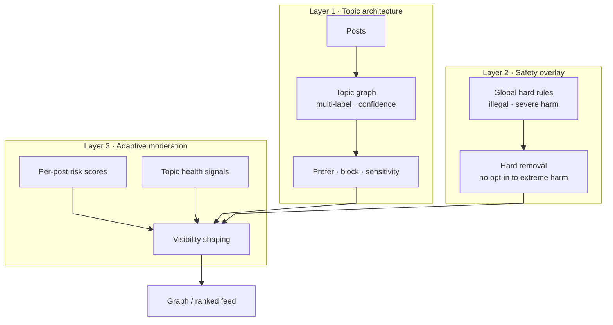
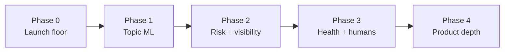

# Moderation System

Bubbler is a **constrained personalization system with a global safety floor**—not a free-speech absolutist platform, and not a fully centralized “trust & safety product” as its primary identity. Users steer what they explore through topics, strategy weights, and blacklists; the platform still enforces non-negotiable safety rules and, over time, shapes *distribution* rather than only deleting or allowing posts.

This document is a **roadmap**. Launch ships a thin safety floor plus the preference controls already in product; later phases deepen topic intelligence, risk-based visibility, and human governance. Do not treat every feature below as required on day one.

Related: [`project_spec.md`](project_spec.md), [`architecture.md`](architecture.md), [`roadmap.md`](roadmap.md), [`TODO`](TODO) (proper AI/ML topic system under FUTURE).

---

## Product stance

| Bubbler is | Bubbler is not |
| --- | --- |
| Preference-shaped exploration on a post graph | An opaque engagement-maximizing feed |
| User control *within* platform safety bounds | “See anything if you opt in” for extreme harm |
| Distribution shaping (rank, quarantine, friction) as the primary lever | Delete-or-allow as the only lever |
| Topics as the unit of taste *and* of community health | Free-form tags alone, without system assistance |

Preference blacklists and strategy weights already encode “what I want to walk toward.” Moderation extends that model: the same ranking and neighbor-selection path can downrank, restrict audience, or remove content—without abandoning the graph walk UX.

---

## Layer 1 — Topic-based content architecture

Topics are Bubbler’s differentiator. Posts attach into a **topic graph** (not a flat category list). Users **prefer**, **block**, and later adjust **sensitivity** per topic or globally.

### Current baseline

Today, posts carry topics used for `topic` / `bridge` edges, preference boosts, blacklists, diversity caps, and session seeding (see [`architecture.md`](architecture.md)). Primary topic drives most preference scoring; multi-topic attachment already exists in spirit but is not yet a full multi-label confidence system.

### Critical upgrade (planned)

Topics must become **system-assisted**, not user-defined only. Manual or naive labeling will not scale with post volume or with preference-based distribution.

Planned direction (aligned with [`TODO`](TODO) FUTURE — “proper topic system (e.g. AI/ML based topic determination)”):

- **AI tagging** and **multi-label classification** when posts are created or updated
- **Confidence scores** per topic label (for ranking, friction, and audit)
- **Newly generated / determined topics** over time—topic inventory is not frozen at launch; models can propose merges, splits, and new nodes as the corpus grows
- Edge rebuild and preference logic should eventually consume multi-label + confidence, not only a single primary topic

Until that lands, moderation still works: safety overlay and reports do not depend on perfect topic ML. Topic health and sensitivity sliders become far more effective *after* system-assisted topics exist.

### Scalability notes

- Prefer batch/async classification on write (and reclassify on edit) over synchronous heavy models in the request path
- Store label confidence so ranking can degrade gracefully when uncertain
- Design topic IDs as stable graph nodes so AI-proposed renames/merges are migrations, not silent renames in user prefs

---

## Layer 2 — Safety overlay (non-optional)

User control never overrides the **global safety floor**. Even if someone prefers a topic or sets sensitivity to “Open,” the platform must still enforce hard rules.

### Always enforce (hard removal)

- Illegal content
- Explicit severe violence (as defined in published guidelines)
- Non-consensual sexual content
- Severe harassment / credible threats

**System behavior:** hard removal (or equivalent non-distribution), not a user preference. There is no “opt-in to extreme harm.”

### Launch vs later

| Phase | Safety overlay |
| --- | --- |
| **Launch** | Published guidelines; report → review queue; manual/admin removal; automated blocks only where cheap and high-precision (e.g. known CSAM hash lists, clear spam patterns) if available |
| **Next** | Broader classifiers for high-precision severe categories; pre-post warnings for borderline cases |
| **Later** | Cross-topic global scan that runs regardless of “safe” topic assignment |

Cross-topic detection matters because preference blacklists and primary-topic scoring can hide violations that live under an otherwise benign topic label. Safety scanning is **orthogonal** to topic preference.

---

## Layer 3 — Adaptive moderation

This layer is how Bubbler combines preference control with platform responsibility: **shape distribution**, don’t only delete.

### A. Risk scoring per post

Every post eventually gets (or can derive) signals such as:

- Toxicity / harassment likelihood
- Misinformation likelihood (where Bubbler chooses to invest)
- Spam probability
- Author reputation / trust

Scores feed ranking and neighbor quotas the same way strategy weights and preference bonuses do today—additional modifiers on the candidate pool, not a separate “moderation app.”

### B. Visibility control

| Risk level | Action |
| --- | --- |
| Low | Show normally in graph / ranked feed |
| Medium | Show mainly to users with matching interest / higher openness |
| High | Downrank heavily; limit hop promotion; optional friction |
| Severe | Remove / non-distribute (safety overlay) |

This fits the existing preference system: medium/high risk content should not appear as an equal “next Bubble” for users on strict defaults, even if a weak semantic or topic edge exists.

### C. Topic-level health monitoring

Track per topic (and later per topic cluster):

- Toxicity / report rates
- Moderator interventions
- Sudden volume or virality spikes

If a topic degrades: raise effective moderation sensitivity, add friction (warnings, rate limits), and potentially **quarantine** (exclude from random/session seeds; restrict `topic`/`bridge` promotion). Topic quarantine is a graph-native lever—cut or demote topic edges without deleting every post.

---

## Human moderation in Bubbler’s model

Humans should not review every post. Focus:

1. **Topic governance** — what a topic allows; edge cases; merge/split decisions as AI proposes new topics
2. **Escalation queues** — high-risk and viral harmful posts
3. **Community audits** — toxic clusters early (abuse rings, coordinated spam across topics)

As social features land (follows, comments, block users—see [`TODO`](TODO)), human queues should expand to those surfaces without changing the three focus areas above.

---

## Product features (phased)

### 1. Topic sensitivity (slider or equivalent)

User chooses roughly **Strict / Balanced / Open**, which adjusts filtering thresholds and risk tolerance on top of prefer/blacklist.

- **Launch:** safe defaults (see § Default protections) + existing prefer/blacklist; sensitivity slider can wait
- **Soon after topics ML:** global sensitivity, then per-topic overrides if needed

### 2. “Why am I seeing this?”

Transparency for a shown Bubble: topic match, preference match, strategy/edge type, and (later) risk band. Supports trust and debugging of the graph walk. Prefer shipping after core ranking is stable; keep explanations honest and short.

### 3. Pre-post friction

Before publish: “This may violate guidelines” / “Are you sure?” when classifiers flag borderline content. Instagram-style friction reduces harm without full automation. Depends on at least a light classifier or rule layer.

### 4. Default protections (conservative discovery)

New accounts start with **documented conservative defaults** persisted at registration—not an empty or “wide open” slate. Users may change every setting in Settings immediately; defaults only define the starting point.

**Conservative** at launch means:

| Setting | Default | Notes |
| --- | --- | --- |
| Feed preset | `stay_in_lane` | Topic/post composition weights for the most topic-focused walk. **Not** a Strict/Balanced/Open sensitivity control—that slider may ship later (F11) as a separate layer on top of prefer/blacklist. |
| Preferred topics | *(none)* | Users may prefer topics from account creation onward. |
| Blacklisted topics | *(none)* | No platform-seeded topic blocklist at launch; this may change as new topics are added. Users may blacklist from account creation onward. |
| Recency boost | **Off** | `use_recency = false` — no age-based ranking bonus until the user opts in. |
| View-time learning | **Off** | `use_view_time = false` — aligns with preference-impact caution in [`TODO`](TODO). |
| AI topic detection | **Off** | `ai_topic_detection = false` until product enables the feature. |

**Registration:** `POST /auth/register` inserts `user_profiles` in the same transaction as the new `users` row, using the values above (`onboarding_completed = false`).

**Onboarding UX:** After the first sign-in, iOS and Android show a feed **preset picker** before the main app. `GET /user/me/preferences` exposes `onboarding_completed`; completing onboarding sets it to `true` via `PUT /user/me/preferences` together with the chosen preset (or recommended defaults on skip). Advanced topic/recency/view-time controls are deferred to Settings—onboarding copy says so explicitly.

See [`architecture.md`](architecture.md) · [`api_contracts.md`](api_contracts.md).

**Safety floor (separate):** conservative discovery defaults do **not** replace the global safety overlay—illegal/severe content is removed regardless of preset or topic prefs. There is no user opt-in to bypass that floor (see Layer 2).

### 5. Cross-topic detection

Global safety scan independent of topic labels. Required before relying on topic quarantine alone.

---

## Roadmap

Phasing favors **launch safety + existing preferences**, then **topic ML** (already on the product FUTURE list), then **adaptive distribution**, then **richer UX**.

### Phase 0 — Initial launch (requirements)

Minimum viable moderation for production:

- [ ] Public community guidelines covering hard-removal categories
- [ ] In-app **report** on posts (and later comments/users as those ship)
- [ ] Admin/moderator ability to **remove** content and restrict accounts
- [x] **Safe defaults** for new accounts (conservative discovery per § Default protections; prefer/blacklist usable from account creation)
- [ ] Preserve existing prefer / blacklist / strategy behavior so users can self-steer
- [ ] Logging of moderation actions for audit
- [ ] No “opt-in” path that bypasses the safety floor

Optional if low-cost: hash/signature blocklists for known severe illegal material; basic spam rate limits on post creation.

**Explicitly not required for launch:** full risk scoring, sensitivity slider, “why am I seeing this,” topic health dashboards, AI topic generation, quarantine automation.

#### Reporter path (abuse & safety)

Guarantees for `POST /user/me/reports` and the staff queue (roadmap L6):

| Rule | Behavior |
| --- | --- |
| Cap details; untrusted text | Optional `details` ≤ 2000 chars; stripped of control characters; staff UIs render as plain text |
| Rate-limit per reporter | Global daily cap per reporter **and** max one report per reporter→author per UTC day |
| Deduplicate open reports | Unique open ticket per `(reporter_id, post_id)`; 409 only for *your* open duplicate |
| No cross-reporter leak | Reporter responses never include other people’s tickets or aggregate “report counts”; public post payloads stay report-free |
| No auto-hide / auto-delete | Filing a report only creates a queue ticket; removal is L7 / human review. Cheap automation (hash lists, etc.) stays optional above |
| CSAM / severe-illegal isolation | Reason `illegal_content` is the severe-illegal bucket. Staff can filter `GET /admin/reports?reason=illegal_content`. Queue snapshots are **text-only** at launch (media is F6). Escalation / NCMEC procedure is L11 — not auto-takedown |

### Phase 1 — System-assisted topics

Depends on / continues the FUTURE item in [`TODO`](TODO) (AI/ML topic determination; note there: continue from step 3.2).

- [ ] Multi-label topic assignment with confidence on create/update
- [ ] Pipeline for **proposing new topics** and consolidating duplicates
- [ ] Preference and edge logic updated to respect multi-label + confidence where it matters
- [ ] Reclassification hooks when models or taxonomies change

### Phase 2 — Risk scores and visibility shaping

- [ ] Per-post risk signals integrated into feed/graph candidate scoring
- [ ] Medium/high risk → restricted distribution (not only binary delete)
- [ ] Pre-post friction for borderline scores
- [ ] Cross-topic safety scan on write (async acceptable)

### Phase 3 — Topic health and human workflows

- [ ] Topic-level metrics (reports, toxicity, interventions)
- [ ] Automated sensitivity bumps / quarantine recommendations
- [ ] Escalation queues for high-risk and viral harmful content
- [ ] Topic governance process for edge cases and AI-proposed topics

### Phase 4 — Product depth and scale

- [ ] Sensitivity control (Strict / Balanced / Open), defaults remain safe
- [ ] “Why am I seeing this?” explanations
- [ ] Author reputation signals feeding risk
- [ ] Stronger misinformation / spam models as needed
- [ ] Alignment with later product work (preference impact stats, Roundabout, media, comments)—each new surface inherits the safety floor and report path

---

## Scalability principles

1. **Async on write** — embedding, topic classification, and risk scoring should not block the critical path longer than necessary; feed reads consume stored scores.
2. **Reuse the ranking path** — visibility shaping is extra modifiers on strategies/preferences/edges, not a second feed product.
3. **Precision-first automation** — automate hard removal only for high-precision severe classes; send the rest to friction or human queues.
4. **Topic as the scale unit** — quarantine or tighten a topic instead of linear growth in per-post human review.
5. **Defaults over configuration** — new accounts start with conservative discovery settings (see § Default protections); openness is explicit in Settings, never the unset state.
6. **Taxonomy evolution** — AI-generated topics need merge/split tooling so preferences and health metrics remain coherent as the graph grows.

---

## Summary

Bubbler’s moderation model is three stacked ideas: **topics for personalization**, a **non-optional safety floor**, and **adaptive distribution** that uses the same graph and preference machinery. Ship the floor and reports first; unlock sensitivity, risk-based hops, and topic quarantine as system-assisted topics and scoring mature—not all at once.
