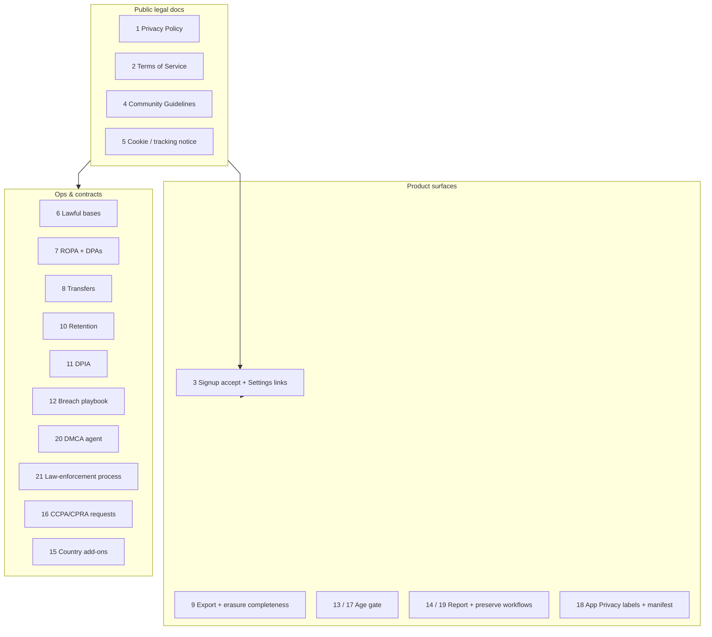

# Privacy & Legal Launch Requirements

Pre-production checklist for releasing Bubbler to the public under **US and EU** rules for social / UGC apps, with an emphasis on privacy.

This is a **product and engineering gap map**, not legal advice. Have counsel review policies, age thresholds, DSA/COPPA applicability, and transfer mechanisms before launch.

**Related:** `[moderation.md](moderation.md)` (Phase 0 safety floor), `[roadmap.md](roadmap.md)` (ordered launch vs future), `[TODO](TODO)` (pre-production features), `[architecture.md](architecture.md)`, `[project_spec.md](project_spec.md)`.

### Current baseline (codebase)

| Area                                    | Status                                                                         |
| --------------------------------------- | ------------------------------------------------------------------------------ |
| Account deletion                        | `DELETE /me` snapshots identity to `deleted_accounts` (no password), then FK cascades; email/username reusable immediately |
| Signup consent / age gate               | Missing (`CreateAccountView`: username, email, password only)                  |
| Privacy Policy / Terms                  | Missing (no docs, no Settings links)                                           |
| Data export / portability               | Missing                                                                        |
| Report / admin remove / audit           | Planned in moderation Phase 0; not shipped                                     |
| App Privacy Manifest / nutrition labels | Missing                                                                        |
| Ads / ATT tracking SDKs                 | Not present in-repo (simpler posture)                                          |

Personal data currently in scope (see `backend/app/db/schema.sql`): username, email, password hash; posts + embeddings; interactions (`preference` / `skip` / `explore`, `feed_preference`, `view_time`); preference profiles and topic prefs; topic training events; planned media attachments.

---

## 1. Privacy Policy

### Requirement

Publish a Privacy Policy that accurately describes what Bubbler collects, why, how long it is kept, who processes it, where it is stored, user rights (GDPR / CCPA), children’s rules, and how to contact you. Must match the real schema and product behavior.

### How to resolve

1. Draft a policy covering at least:
  - **Identity:** email, username, password hash
  - **Content:** posts, topics, future media (`storage_key`, mime, dimensions, alt text)
  - **Derived / ML:** MiniLM embeddings, similarity edges, optional AI topic labels / training events
  - **Behavioral:** feed preferences (-2..+2), skips, explores, view time; preference weights and blacklists
  - **Technical:** auth tokens (Keychain), server logs if any, IP/device data if collected later
2. State purposes: account, feed personalization, safety/moderation, security, legal compliance.
3. List processors (e.g. Supabase/Postgres host, future email provider, CDN for media).
4. Host on a stable HTTPS URL; version and date the document.
5. Keep the policy in sync when media, analytics, or email land (`[TODO](TODO)`).

**Owner:** founder + counsel. **Eng dependency:** data inventory from schema and API routes.

---

## 2. Terms of Service

### Requirement

Binding Terms covering account eligibility, acceptable use, UGC license (permission for Bubbler to host, display, embed, and moderate content), IP, disclaimers, limitation of liability, termination, governing law, and incorporation of Community Guidelines and Privacy Policy.

### How to resolve

1. Draft ToS with a clear **user content license** (not a claim of ownership of user posts).
2. Describe moderation rights (remove, restrict, suspend) aligned with `[moderation.md](moderation.md)` safety floor.
3. Include DMCA / IP complaint pointer (see §20).
4. Define account termination and effect on content (hard delete vs anonymize—must match `DELETE /me` behavior).
5. Host alongside Privacy Policy; link from signup and Settings.

**Owner:** counsel. **Eng dependency:** none beyond linking UI (§3).

---

## 3. In-app acceptance and persistent links

### Requirement

Users must be able to review Privacy Policy and Terms **before** account creation, and find them again later. EU transparency and App Store review both expect discoverable policies.

### How to resolve

1. On `CreateAccountView`, add required acknowledgment (checkbox or “By continuing you agree…”) with tappable links to Privacy Policy and Terms (open in Safari / `SFSafariViewController`).
2. Block register until acknowledged (client + optionally record `tos_accepted_at` / policy version on `users`).
3. In `SettingsView`, add a **Legal** section: Privacy Policy, Terms, Community Guidelines, and (later) data export / privacy requests.
4. Re-prompt or notify when material policy versions change (store `accepted_privacy_version`).

**Owner:** iOS + backend (optional acceptance audit fields).

---

## 4. Community Guidelines

### Requirement

Public rules for hard-removal categories and everyday conduct. Phase 0 in `[moderation.md](moderation.md)` already lists this as launch-required.

### How to resolve

1. Publish guidelines covering illegal content, severe violence, NCII, severe harassment/threats, spam, and any Bubbler-specific norms.
2. Cross-link from ToS and in-app report UI (“This violates…”).
3. Keep language consistent with what admins actually enforce.
4. Ship with report → review → remove (Phase 0); guidelines without enforcement are insufficient for DSA-style duties.

**Owner:** product + counsel. **Eng:** report surfaces and admin tools (see §14, `[moderation.md](moderation.md)`).

---

## 5. Cookie / tracking notice

### Requirement

If Bubbler uses a website, web login, analytics pixels, or email tracking, ePrivacy / cookie rules and US state “sharing” disclosures may apply. A pure native app with no trackers still needs clarity if a marketing site exists.

### How to resolve

1. Inventory: marketing site, cookies, analytics (Plausible/GA/etc.), email open pixels.
2. If **no** non-essential cookies/trackers: short site notice (“essential only”) may suffice; document that the iOS app does not use third-party advertising SDKs.
3. If analytics or ads are added: consent banner / CMP for EU, update Privacy Policy and Apple nutrition labels (§18), and revisit CCPA “sale/share” (§16).
4. Prefer first-party, privacy-preserving analytics if any metrics are needed.

**Owner:** web + product. **Default launch path:** no non-essential trackers; state that explicitly in the Privacy Policy.

---

## 6. Lawful bases and purpose mapping (GDPR)

### Requirement

For each processing purpose, identify a lawful basis (GDPR Art. 6), and for special cases (children, automated profiling) document Art. 8 / Art. 22 considerations. Recommendation and view-time learning are **profiling**.

### How to resolve

1. Build a table, for example:

  | Purpose                       | Data                      | Basis (typical)                          |
  | ----------------------------- | ------------------------- | ---------------------------------------- |
  | Account / auth                | email, username, password | Contract                                 |
  | Show feed / graph             | posts, prefs, embeddings  | Contract / legitimate interest           |
  | View-time preference learning | `view_time`, interactions | Consent or legitimate interest + opt-out |
  | Safety / illegal content      | reports, content copies   | Legal obligation / legitimate interest   |
  | Email reset (future)          | email                     | Contract                                 |

2. Align product toggles with the table (`use_view_time` already exists—treat as profiling control).
3. Reflect bases in the Privacy Policy; do not claim “consent” for everything if signup consent is only ToS acceptance.
4. Counsel sign-off on legitimate-interest assessments (LIA) where used.

**Owner:** counsel + product. **Eng:** ensure opt-outs are honored in `FeedService` / prefs.

---

## 7. Records of processing (ROPA) and vendor DPAs

### Requirement

Controllers must maintain records of processing activities and have appropriate contracts with processors (GDPR Arts. 28 / 30).

### How to resolve

1. Maintain an internal ROPA: systems (iOS app, FastAPI, Postgres/Supabase), categories of data subjects, data types, recipients, retention, security measures.
2. Sign **Data Processing Agreements** with Supabase (or host), email provider (forgot-password on `[TODO](TODO)`), object storage for media, and any ML API vendors.
3. Publish a short **subprocessors list** (or section in Privacy Policy) and a process to update it.
4. Restrict vendor access (least privilege DB roles, no shared prod credentials in clients).

**Owner:** ops + counsel. **Eng:** environment/secrets hygiene (`config.py` env vars; never ship `SECRETKEY` to the client).

---

## 8. International data transfers

### Requirement

If EU/UK personal data is stored or accessed in the US (common with Supabase/US hosting), document a transfer mechanism (e.g. SCCs) and residual risk steps.

### How to resolve

1. Confirm region of the production database and backups.
2. Prefer **EU-region** hosting if launching in the EU first; otherwise execute SCCs / vendor transfer addenda.
3. Describe transfers in the Privacy Policy (“hosted in …”).
4. Minimize US access to EU data (admin SSO, audit logging of support access).

**Owner:** ops + counsel. **Eng:** choose Supabase/project region deliberately before production data lands.

---

## 9. Data subject rights beyond delete

### Requirement

GDPR Arts. 15–20 (and CCPA analogues): access, rectification, erasure, restriction, portability, objection. Bubbler already supports erasure-ish delete; portability and full access are incomplete.

### How to resolve

1. **Export:** add `GET /me/export` (or async job) returning machine-readable JSON/ZIP: profile, posts, interactions, preferences, topic training events, media metadata.
2. **Access:** same export, plus in-app ability to view/edit email, username, posts (partially exists via settings/profile).
3. **Erasure completeness:** `DELETE FROM users` cascades after writing `deleted_accounts`; email/username can be reused immediately. Document backup TTL, log scrubbing, the 90-day identity tombstone, and moderation-ticket handling; Delete Account copy already discloses leftovers.
4. **Objection / restriction:** honor `use_view_time = false` and blacklist controls; add a documented “limit personalization” path if counsel requires it.
5. **Intake:** privacy@ / in-app form for rights requests with identity verification (password or signed-in session).

**Owner:** backend + iOS. **Priority:** export endpoint + Settings entry before EU launch.

---

## 10. Retention schedule

### Requirement

Do not keep personal data longer than necessary.

### Status

**Partial.** Beta schedule, schema support, config defaults, retention job (`scripts/run_retention.py`), identity tombstone (`deleted_accounts`), and `resolved_at` wiring are documented in [`retention.md`](retention.md). Staff legal-hold API/UI and ops items (log/backup TTL, Privacy Policy summary) remain open.

### How to resolve

1. Follow the schedule in [`retention.md`](retention.md) (live accounts: life of account; deleted-account identity: 90 days; explore/skip interactions: rolling window; training events: anonymize then delete; limit tables: 90 days; closed reports: counsel-aligned; logs/backups: ops config).
2. Implement scheduled jobs (SQL deletes or anonymization) matching `backend/config.py` retention windows.
3. Publish summary retention periods in the Privacy Policy.

**Owner:** product + backend. **Eng:** cron/worker against `interactions`, `topic_training_events`, limit tables, closed `content_reports`, and `deleted_accounts`.

---

## 11. DPIA (Data Protection Impact Assessment)

### Requirement

GDPR Art. 35: DPIA when processing is likely high risk—systematic profiling, large-scale UGC, sensitive inferences from content/behavior.

### How to resolve

1. Run a DPIA before intentional EU availability covering: recommendation graph, embeddings, view-time learning, UGC hosting, future media, moderation tooling.
2. Record risks, mitigations (minimization, encryption, access control, safe defaults, report flows), and residual risk.
3. Revisit DPIA when media, comments, or third-party analytics ship.
4. Keep the DPIA internal; surface mitigations in product and Privacy Policy.

**Owner:** counsel / DPO-equivalent + eng lead.

---

## 12. Breach playbook

### Requirement

Personal-data breaches require timely assessment and, where applicable, regulator notification (GDPR ~72 hours) and user notice. US state laws increasingly require notification too.

### How to resolve

1. Written incident response plan: detect → contain → investigate → notify → remediate.
2. Define severity levels, on-call owner, counsel contact, and evidence preservation.
3. Inventory systems in scope (DB, JWT secret, Keychain-only client tokens, future email).
4. Practice once (tabletop) before launch.
5. Ensure logging is enough to detect abuse but retained per §10.

**Status:** **Partial.** Internal scaffold in [`breach_playbook.md`](breach_playbook.md). Contacts, counsel review, tabletop, and Privacy Policy paragraph still required.

**Owner:** ops. **Eng:** secrets rotation procedure for `SECRETKEY`, DB credentials; force token invalidation path if JWTs are long-lived.

---

## 13. Age / children’s rules (GDPR Art. 8)

### Requirement

EU digital-consent age is typically 16 (member states may lower to 13). Processing children’s data needs parental consent where applicable. Signup currently has **no** age collection or gate.

### How to resolve

1. Choose a minimum age (commonly **16+** for EU-friendly launch, or **13+** US-only with COPPA controls—prefer one clear global floor).
2. Add DOB or “I am N or older” confirmation on `CreateAccountView`; reject under-age server-side (`date_of_birth` or `age_attested_at` on `users`).
3. State the minimum age in ToS, Privacy Policy, and App Store rating.
4. Do not knowingly profile children; if under-age accounts appear, delete and document.

**Owner:** product + iOS + backend. **Align with** §17 (COPPA).

---

## 14. DSA (EU Digital Services Act) — UGC hosting

### Requirement

If Bubbler is offered in the EU, hosting user posts triggers intermediary duties: notice-and-action for illegal content, transparency in Terms, user-facing statements for restrictions, complaint handling, and recommender disclosures. Phase 0 moderation is necessary but not sufficient alone.

### How to resolve

1. Ship Phase 0 from `[moderation.md](moderation.md)`: guidelines, in-app **report**, admin remove/restrict, audit logs, safe defaults.
2. Add an **illegal content** reporting channel (in-app + email) with acknowledgment of receipt.
3. On remove/suspend: notify the user with **statement of reasons** (what rule, what action).
4. Provide an **internal complaint / appeal** path and SLA.
5. Disclose recommender main parameters in Terms (strategy weights, topic prefer/blacklist, view-time, diversity—map to real `FeedService` behavior).
6. Publish a point of contact / legal representative if required for your entity type and reach.
7. Plan transparency reporting if you approach larger DSA tiers.

**Owner:** product + counsel + eng (report/admin/appeals). **Depends on:** Phase 0 implementation.

---

## 15. Country add-ons (e.g. Impressum)

### Requirement

Some EU countries require provider identification on sites/apps (notably German **Impressum** / Telemediengesetz-style info): legal name, address, contact, and sometimes registration details.

### How to resolve

1. Decide launch geos. If DE/AT/similar are in scope, publish an Imprint/Impressum page linked from Settings and the website.
2. Ensure company/entity exists and contact email is monitored.
3. Mirror required consumer information in ToS where applicable.

**Owner:** counsel / entity setup. **Eng:** Settings link only.

---

## 16. CCPA / CPRA (California) and similar state laws

### Requirement

If Bubbler does business with California residents: notice at collection, rights to know / delete / correct, and—if applicable—opt-out of sale or share of personal information and limits on sensitive PI. Other states (VA, CO, CT, etc.) add similar duties as you scale.

### How to resolve

1. “Notice at collection” = Privacy Policy summary at signup (§1, §3).
2. Support **Know / Delete / Correct** via export (§9), `DELETE /me`, and profile/email edit.
3. If you **do not** sell/share data for cross-context ads: state “We do not sell or share personal information” and avoid ad pixels that create “sharing.”
4. Provide a request method: logged-in controls + privacy@ for non-app requests; verify identity.
5. Revisit when adding analytics, advertising, or data brokers.

**Owner:** counsel + eng (export/delete already partially done).

---

## 17. COPPA (US children under 13)

### Requirement

Collecting personal information from children under 13 requires parental consent and strict limits. Easiest compliant product posture: **do not allow under-13 accounts**.

### How to resolve

1. Set App Store age rating and ToS minimum age ≥ 13 (preferably higher to satisfy §13).
2. Age gate at registration (§13); block under-13 server-side.
3. Privacy Policy: “Bubbler is not directed to children under 13.”
4. If you later allow teens 13–15, get separate COPPA counsel review (parental consent mechanisms).
5. Moderation: remove under-age users when discovered.

**Owner:** product + counsel. **Eng:** shared age attestation with §13.

---

## 18. Apple App Privacy (labels + Privacy Manifest)

### Requirement

App Store Connect privacy nutrition labels must match actual data collection. Privacy Manifest (`PrivacyInfo.xcprivacy`) is required for certain APIs and third-party SDKs.

### How to resolve

1. Complete App Privacy answers from the real inventory (§1): contact info, user content, usage data (interactions/view time), diagnostics if any.
2. Add `PrivacyInfo.xcprivacy` to the Xcode project when using APIs that require reasons (or when adding SDKs).
3. When media ships (`[TODO](TODO)`): add Photo Library / Camera usage descriptions (`Info.plist`) and update labels.
4. Re-audit labels whenever embeddings, analytics, or crash reporters are added.
5. Do not declare “no data collected” while email/posts/interactions exist.

**Owner:** iOS. **Blocker for App Store release.**

---

## 19. CSAM and severe illegal content reporting (US)

### Requirement

US law generally requires certain online providers that obtain **actual knowledge** of CSAM to report to **NCMEC** and preserve related data. Phase 0’s optional hash blocklists help prevention; reporting/preservation is a separate legal workflow.

### How to resolve

1. Register / prepare NCMEC CyberTipline reporting capability before hosting public UGC at scale (especially images—`[TODO](TODO)` media).
2. Train mods: do not redistribute CSAM; preserve evidence per counsel; escalate immediately.
3. Implement **legal hold**: freeze deletion of reported content/accounts pending report (may conflict with casual `DELETE`—gate admin tools).
4. Optional: PhotoDNA / hash-matching on media upload (Phase 0 optional in `[moderation.md](moderation.md)`).
5. Document the workflow next to Community Guidelines for internal staff only.

**Owner:** counsel + trust & safety. **Eng:** admin preserve flag; media pipeline hooks.

---

## 20. DMCA agent (US Copyright Act §512)

### Requirement

To invoke safe-harbor protections for user-stored content, designate a DMCA agent, publish contact info, and register with the Copyright Office.

### How to resolve

1. Designate an agent (person or service); publish email/address in Terms and on the website.
2. File registration with the U.S. Copyright Office; keep it updated.
3. Implement notice → acknowledge → remove/disable → counternotice process (can start as manual email + admin hide/delete post).
4. Log DMCA actions in the same audit trail as moderation (§14 / Phase 0).

**Owner:** counsel + ops. **Eng:** admin ability to remove posts by ID (exists for owners; need staff tooling).

---

## 21. Law-enforcement / government request process

### Requirement

Have a defined intake for subpoenas, warrants, and emergency disclosure requests: authenticate the request, minimize data produced, and decide when users are notified.

### How to resolve

1. Publish a law-enforcement guidelines page (contact email, what you can produce, response expectations).
2. Internal runbook: verify agency, require valid legal process, escalate to counsel, produce least data necessary.
3. User notice policy (notify unless legally prohibited; emergency exceptions).
4. Technical readiness: lookup by user id/email/username; export subset of records; preserve on legal hold (§19).
5. Never invent informal “favor” disclosures outside the runbook.

**Owner:** counsel + ops. **Eng:** support/admin read-only tools with access logging.

---

## Suggested implementation order

| Priority                                | Items                                                        | Notes                                        |
| --------------------------------------- | ------------------------------------------------------------ | -------------------------------------------- |
| **P0 — before any public users**        | 1, 2, 3, 4, 13, 17, 18                                       | Policies, acceptance, age, App Store privacy |
| **P0 — with UGC at scale**              | 9 (export + erasure truth), 10, 12, 14 (Phase 0), 19, 20, 21 | Rights, retention, breach, safety/legal ops  |
| **P0 — if EU in scope**                 | 6, 7, 8, 11, 14, 15                                          | Bases, DPAs, transfers, DPIA, DSA, imprint   |
| **P0 — if CA residents**                | 16 (+ 1, 9)                                                  | Notice + request handling                    |
| **P1 — when web/analytics/email/media** | 5, refresh 1/7/18/19                                         | Cookies, processors, labels, CSAM on media   |

Product work already tracked elsewhere that unblocks several items: Phase 0 report/remove/audit (`[moderation.md](moderation.md)`); block users, media, forgot-password email (`[TODO](TODO)`).

---

## Summary

Items **1–5** are public-facing legal documents and UX. Items **6–15** are primarily EU privacy and platform duties. Items **16–21** are US-focused privacy, store, and illegal-content/IP/process obligations. Bubbler’s existing delete-account path and preference controls are a head start on erasure and recommender transparency; the largest gaps are **written policies + acceptance**, **age gating**, **export/retention/processors**, **App Privacy**, and **report/DMCA/CSAM/LE workflows** around UGC.