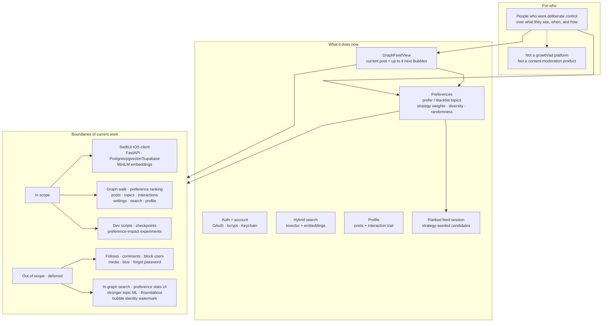

# Project Specification

Bubbler is a **user-controlled social exploration app**: posts live on a directed topic/semantic graph, and the person browsing chooses the next hop instead of scrolling a opaque ranked list.

## One-line scope

| Axis | Current answer |
| --- | --- |
| **Does** | Lets a signed-in user explore posts as a graph of Bubbles, shaped by explicit preference and strategy controls, plus search and profile. |
| **For who** | End users who want an algorithm built for them—not for engagement farming or selling attention. |
| **Boundary** | Vertical slice of graph feed + preferences + auth/search/profile on the stack above. Social network features, media, and deeper analytics are deferred (see [`TODO`](TODO)). |

## Related docs

- [`architecture.md`](architecture.md) — graph model, ranking, request flow
- [`api_contracts.md`](api_contracts.md) — preference and feed/search payloads
- [`TODO`](TODO) — immediate testing, pre-production, and future work
