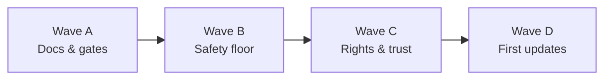

# Pre-Launch Roadmap

Ordered plan for shipping Bubbler to the public. Derived from [`TODO`](TODO) (BEFORE PRODUCTION), [`moderation.md`](moderation.md) Phase 0+, and [`privacy_legal.md`](privacy_legal.md).

**Launch scope assumes EU and California** are in market. Launch = legal/store/safety floor + a few product fixes. Everything else is sequenced as post-launch updates.

This is a **product and engineering roadmap**, not legal advice. Counsel should review policies, age thresholds, DSA/COPPA/CCPA applicability, and transfer mechanisms before production.

**Related:** [`project_spec.md`](project_spec.md), [`architecture.md`](architecture.md), [`moderation.md`](moderation.md), [`privacy_legal.md`](privacy_legal.md), [`TODO`](TODO).

| Bucket | Count | Meaning |
| --- | --- | --- |
| Hard blockers | 7 | Must ship before any public users / App Store |
| Also for launch | 12 | Required for soft launch with EU + CA in scope |
| Soon after launch | 3 | First post-launch updates |
| Later updates | 7 | Social/media depth and adaptive moderation |

### Split rule

[`TODO`](TODO) lists many product items under BEFORE PRODUCTION. This roadmap treats store/legal/safety as launch-blocking, keeps block-users and preference clarity as launch, and moves follows, bio, media, graph search, topic ML, and adaptive moderation to post-launch—matching [`moderation.md`](moderation.md) Phase 0 and [`project_spec.md`](project_spec.md) deferred scope.

---

## Needed for initial launch

Ship before public users. Suggested build order: policies & age → App Privacy → report/admin tools → EU/CA ops → export/retention/runbooks → block users + pref clarity.

### Hard blockers

| # | Feature | Why | Source | Owner |
| --- | --- | --- | --- | --- |
| L1 | Privacy Policy + Terms of Service | Store review, GDPR/CCPA notice, and signup acceptance all require accurate public docs. | privacy_legal §1–2 · P0 | Counsel + founder |
| L2 | Community Guidelines | Published hard-removal rules; needed for DSA duties and report UX. | privacy_legal §4 · moderation Phase 0 | Product + counsel |
| L3 | Signup acceptance + Settings legal links | Users must see policies before create-account and find them later. | privacy_legal §3 | iOS (+ optional backend) |
| L4 | Age gate (≥13 / prefer **16+** for EU-friendly floor) | No age collection today; COPPA + GDPR Art. 8 blockers. | privacy_legal §13 · §17 | iOS + backend |
| L5 | Apple App Privacy labels + Privacy Manifest | Hard App Store release requirement; must match real collection. | privacy_legal §18 | iOS |
| L6 | In-app report → review queue | Minimum notice-and-action for public UGC; Phase 0 floor. | moderation Phase 0 · privacy_legal §14 | iOS + backend |
| L7 | Admin remove / restrict + audit logging | Guidelines without enforcement are insufficient; DMCA/DSA need staff tools. | moderation Phase 0 · privacy_legal §14/20 | Backend + ops |

### Also for launch

| # | Feature | Why | Source | Owner |
| --- | --- | --- | --- | --- |
| L8 | Safe discovery defaults for new accounts | Conservative prefs; no opt-in path around the safety floor. | moderation Phase 0 · TODO caution | Product + backend |
| L9 | Data export + erasure completeness | GDPR portability / CCPA know+delete; delete exists, export does not. | privacy_legal §9 · P0 with UGC | Backend + iOS |
| L10 | Retention schedule + breach playbook | Document + implement TTLs; 72h-ready incident response before public users. | privacy_legal §10 · §12 | Ops + backend |
| L11 | DMCA agent + CSAM / LE runbooks | US safe harbor + NCMEC / government request processes around UGC. | privacy_legal §19–21 | Counsel + T&S |
| L12 | Block users | Harassment control for a public social product; expands with follows later. | TODO before prod · moderation human queues | iOS + backend |
| L13 | Clarify preference / similarity settings | Users may expect topic-based similarity; core product trust at launch. | TODO before prod | Product + iOS |

### EU requirements (in scope)

| # | Requirement | Why | Source | Owner |
| --- | --- | --- | --- | --- |
| L14 | Lawful bases + purpose mapping (incl. view-time profiling) | Recommendation and view-time learning are profiling; bases must match product toggles. | privacy_legal §6 | Counsel + product |
| L15 | ROPA + vendor DPAs + subprocessors list | GDPR Arts. 28 / 30; contracts with host, future email, storage, ML vendors. | privacy_legal §7 | Ops + counsel |
| L16 | International transfer mechanism / region choice | Document SCCs or prefer EU-region hosting before production data lands. | privacy_legal §8 | Ops + counsel |
| L17 | DPIA before intentional EU availability | Art. 35 for systematic profiling, UGC, embeddings, view-time learning. | privacy_legal §11 | Counsel + eng lead |
| L18 | DSA notice-and-action, statement of reasons, appeals | Beyond Phase 0: illegal-content channel, user notice on restrict, complaint path, recommender disclosure in Terms. | privacy_legal §14 | Product + counsel + eng |
| L19 | Impressum / country provider ID | Required where DE/AT (and similar) are offered; link from Settings and site. | privacy_legal §15 | Counsel + iOS |

### California requirements (in scope)

| # | Requirement | Why | Source | Owner |
| --- | --- | --- | --- | --- |
| L20 | CCPA/CPRA notice + know / delete / correct | Notice at collection via Privacy Policy; fulfill via export, `DELETE /me`, and profile edit; state no sale/share if true. | privacy_legal §16 (+ §1, §9) | Counsel + eng |

### Cookie / tracking notice (launch posture)

| # | Requirement | Why | Source | Owner |
| --- | --- | --- | --- | --- |
| L21 | No non-essential trackers; disclose in Privacy Policy | Default launch path for ePrivacy / CCPA “share”; refresh when analytics or email pixels appear. | privacy_legal §5 · P1 | Web + product |

---

## Can come in a future update

### Soon after launch

Unblocks account recovery and the next moderation phases.

| # | Feature | Why | Source | Owner |
| --- | --- | --- | --- | --- |
| F1 | Forgot password + email delivery | Account recovery; needs transactional email provider + DPAs. | TODO before prod · privacy_legal §7 | Backend + ops |
| F2 | System-assisted topic ML | Unlocks topic health, sensitivity, and better prefs; not Phase 0. | moderation Phase 1 · TODO | Backend / ML |
| F3 | Graph-view local search | Discover connected clusters without leaving the walk. | TODO before prod | iOS + backend |

### Later updates

Social/media depth and adaptive distribution.

| # | Feature | Why | Source | Owner |
| --- | --- | --- | --- | --- |
| F4 | Follow others | Social graph growth; not required for safety floor or store release. | TODO · project_spec deferred | iOS + backend |
| F5 | Profile bio | Profile polish; no legal/safety dependency. | TODO · project_spec deferred | iOS + backend |
| F6 | Media attachments | Major surface; triggers Photo Library labels, CSAM hashing, DPIA refresh. | TODO · privacy_legal §18–19 | Full stack + T&S |
| F7 | Risk scores + visibility shaping | Distribution moderation beyond delete; depends on scoring pipeline. | moderation Phase 2 | Backend |
| F8 | Topic health, quarantine, sensitivity UX | Adaptive layer + Strict/Balanced/Open; after topic ML. | moderation Phase 3–4 | Product + backend |
| F9 | Bubble watermark / identity color | Visual identity for authors in the graph. | TODO FUTURE (from 3.2) | iOS |
| F10 | Preference-impact statistics + Roundabout | Show real preference effects; careful with likes/comments/stats amplification. | TODO FUTURE · caution note | Product |

---

## Recommended sequence

### Wave A — Public docs & gates

Privacy Policy, ToS, Community Guidelines → signup accept + age gate (16+ preferred) → App Privacy labels/manifest → Impressum link if DE/AT offered.

### Wave B — Safety floor

Report + admin remove/restrict + audit logs → safe defaults → DMCA / CSAM / LE runbooks → DSA statement-of-reasons + appeals path.

### Wave C — Rights, geo compliance & product trust

Export + retention + breach playbook → lawful bases, ROPA/DPAs, transfers, DPIA → CCPA request handling → block users → preference / similarity clarity → soft launch.

### Wave D — First updates

Forgot-password email → topic ML → graph search → then follows / bio / media → risk & visibility → stats / Roundabout.

---

## Checklist (launch)

Use this as a pre-production gate. Unchecked items block public launch under the EU + CA assumption.

**Hard blockers**

- [ ] L1 Privacy Policy + Terms of Service
- [ ] L2 Community Guidelines
- [ ] L3 Signup acceptance + Settings legal links
- [ ] L4 Age gate
- [ ] L5 Apple App Privacy labels + Privacy Manifest
- [ ] L6 In-app report → review queue
- [ ] L7 Admin remove / restrict + audit logging

**Also for launch**

- [ ] L8 Safe discovery defaults
- [ ] L9 Data export + erasure completeness
- [ ] L10 Retention schedule + breach playbook
- [ ] L11 DMCA agent + CSAM / LE runbooks
- [ ] L12 Block users
- [ ] L13 Preference / similarity clarity

**EU**

- [ ] L14 Lawful bases + purpose mapping
- [ ] L15 ROPA + DPAs + subprocessors
- [ ] L16 Transfers / hosting region
- [ ] L17 DPIA
- [ ] L18 DSA notice-and-action, reasons, appeals
- [ ] L19 Impressum (where required)

**California**

- [ ] L20 CCPA/CPRA notice + rights fulfillment

**Tracking posture**

- [ ] L21 No non-essential trackers; Privacy Policy states this

---

## Summary

Launch ships the **safety floor**, **US/EU/CA legal surfaces**, and **two product trust items** (block users, preference clarity). Follows, bio, media, graph search, topic ML, and adaptive moderation stay in **future updates**, even where [`TODO`](TODO) listed them under BEFORE PRODUCTION.
