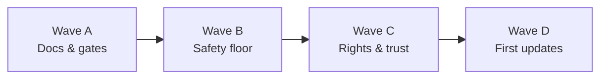
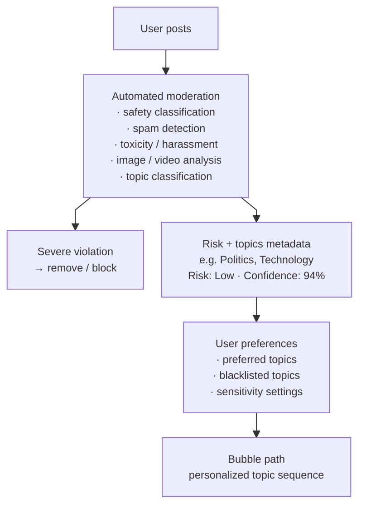
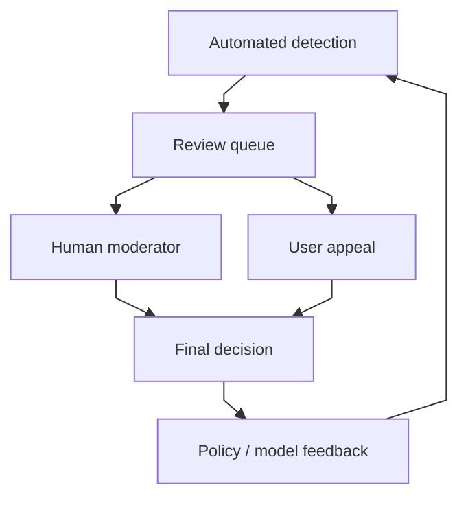

# Pre-Launch Roadmap

Ordered plan for shipping Bubbler to the public. Derived from `[TODO](TODO)` (BEFORE PRODUCTION), `[moderation.md](moderation.md)` Phase 0+, and `[privacy_legal.md](privacy_legal.md)`.

**Launch scope assumes EU and California** are in market. Launch = legal/store/safety floor + a few product fixes. Everything else is sequenced as post-launch updates.

This is a **product and engineering roadmap**, not legal advice. Counsel should review policies, age thresholds, DSA/COPPA/CCPA applicability, and transfer mechanisms before production.

**Clients:** `BubblerApp/` (iOS / SwiftUI) and `BubblerAndroid/` (Kotlin / Compose) are parallel frontends against the same FastAPI backend. Ship launch and post-launch client features on **both** unless a row says otherwise. Port sequencing: [`android_rewrite_order.md`](android_rewrite_order.md), layout: [`android_filemap.md`](android_filemap.md).

**Related:** `[project_spec.md](project_spec.md)`, `[architecture.md](architecture.md)`, `[moderation.md](moderation.md)`, `[privacy_legal.md](privacy_legal.md)`, `[TODO](TODO)`.

| Bucket            | Count | Meaning                                                         |
| ----------------- | ----- | --------------------------------------------------------------- |
| Hard blockers     | 8     | Must ship before any public users / App Store / Play            |
| Also for launch   | 12    | Required for soft launch with EU + CA in scope                  |
| Soon after launch | 3     | First post-launch updates                                       |
| Later updates     | 10    | Social/media depth and user-controlled moderation architecture  |

### Split rule

`[TODO](TODO)` lists many product items under BEFORE PRODUCTION. This roadmap treats store/legal/safety as launch-blocking, keeps block-users and preference clarity as launch, and moves follows, bio, media, graph search, topic ML, and the user-controlled moderation architecture to post-launch—matching `[moderation.md](moderation.md)` Phase 0 and `[project_spec.md](project_spec.md)` deferred scope.

---

## Needed for initial launch

Ship before public users. Suggested build order: policies & age → App Privacy / Play Data Safety → report/admin tools → EU/CA ops → export/retention/runbooks → block users + pref clarity.

### Hard blockers

| #   | Feature                                               | Why                                                                                     | Source                                    | Owner                         |
| --- | ----------------------------------------------------- | --------------------------------------------------------------------------------------- | ----------------------------------------- | ----------------------------- |
| L1  | Privacy Policy + Terms of Service                     | Store review, GDPR/CCPA notice, and signup acceptance all require accurate public docs. | privacy_legal §1–2 · P0                   | Counsel + founder             |
| L2  | Community Guidelines                                  | Published hard-removal rules; needed for DSA duties and report UX.                      | privacy_legal §4 · moderation Phase 0     | Product + counsel             |
| L3  | Signup acceptance + Settings legal links              | Users must see policies before create-account and find them later.                      | privacy_legal §3                          | iOS + Android (+ optional backend) |
| L4  | Age gate (≥13 / prefer **16+** for EU-friendly floor) | No age collection today; COPPA + GDPR Art. 8 blockers.                                  | privacy_legal §13 · §17                   | iOS + Android + backend       |
| L5  | Apple App Privacy labels + Privacy Manifest           | Hard App Store release requirement; must match real collection.                         | privacy_legal §18                         | iOS                           |
| L5a | Google Play Data Safety                               | Hard Play Console requirement; must match the same collection inventory as L5.          | privacy_legal §18 (parity) · Play Console | Android                       |
| L6  | In-app report → review queue                          | Minimum notice-and-action for public UGC; Phase 0 floor.                                | moderation Phase 0 · privacy_legal §14    | iOS + Android + backend       |
| L7  | Admin remove / restrict + audit logging               | Guidelines without enforcement are insufficient; DMCA/DSA need staff tools.             | moderation Phase 0 · privacy_legal §14/20 | Backend + ops                 |

### Also for launch

| #   | Feature                                  | Why                                                                         | Source                                     | Owner                  |
| --- | ---------------------------------------- | --------------------------------------------------------------------------- | ------------------------------------------ | ---------------------- |
| L8  | Safe discovery defaults for new accounts | Conservative prefs; no opt-in path around the safety floor.                 | moderation Phase 0 · TODO caution          | Product + backend      |
| L9  | Data export + erasure completeness       | GDPR portability / CCPA know+delete; delete exists, export does not.        | privacy_legal §9 · P0 with UGC             | Backend + iOS + Android |
| L10 | Retention schedule + breach playbook     | Document + implement TTLs; 72h-ready incident response before public users. | privacy_legal §10 · §12                    | Ops + backend          |
| L11 | DMCA agent + CSAM / LE runbooks          | US safe harbor + NCMEC / government request processes around UGC.           | privacy_legal §19–21                       | Counsel + T&S          |
| L12 | Block users                              | Harassment control for a public social product; expands with follows later. | TODO before prod · moderation human queues | iOS + Android + backend |
| L13 | Clarify preference / similarity settings | Users may expect topic-based similarity; core product trust at launch.      | TODO before prod                           | Product + iOS + Android — **in progress:** two-tier composition + presets shipped |

### EU requirements (in scope)

| #   | Requirement                                                | Why                                                                                                                | Source            | Owner                   |
| --- | ---------------------------------------------------------- | ------------------------------------------------------------------------------------------------------------------ | ----------------- | ----------------------- |
| L14 | Lawful bases + purpose mapping (incl. view-time profiling) | Recommendation and view-time learning are profiling; bases must match product toggles.                             | privacy_legal §6  | Counsel + product       |
| L15 | ROPA + vendor DPAs + subprocessors list                    | GDPR Arts. 28 / 30; contracts with host, future email, storage, ML vendors.                                        | privacy_legal §7  | Ops + counsel           |
| L16 | International transfer mechanism / region choice           | Document SCCs or prefer EU-region hosting before production data lands.                                            | privacy_legal §8  | Ops + counsel           |
| L17 | DPIA before intentional EU availability                    | Art. 35 for systematic profiling, UGC, embeddings, view-time learning.                                             | privacy_legal §11 | Counsel + eng lead      |
| L18 | DSA notice-and-action, statement of reasons, appeals       | Beyond Phase 0: illegal-content channel, user notice on restrict, complaint path, recommender disclosure in Terms. | privacy_legal §14 | Product + counsel + eng |
| L19 | Impressum / country provider ID                            | Required where DE/AT (and similar) are offered; link from Settings and site.                                       | privacy_legal §15 | Counsel + iOS + Android |

### California requirements (in scope)

| #   | Requirement                                | Why                                                                                                                       | Source                       | Owner         |
| --- | ------------------------------------------ | ------------------------------------------------------------------------------------------------------------------------- | ---------------------------- | ------------- |
| L20 | CCPA/CPRA notice + know / delete / correct | Notice at collection via Privacy Policy; fulfill via export, `DELETE /me`, and profile edit; state no sale/share if true. | privacy_legal §16 (+ §1, §9) | Counsel + eng |

### Cookie / tracking notice (launch posture)

| #   | Requirement                                           | Why                                                                                             | Source                | Owner         |
| --- | ----------------------------------------------------- | ----------------------------------------------------------------------------------------------- | --------------------- | ------------- |
| L21 | No non-essential trackers; disclose in Privacy Policy | Default launch path for ePrivacy / CCPA “share”; refresh when analytics or email pixels appear. | privacy_legal §5 · P1 | Web + product |

---

## Can come in a future update

### Soon after launch

Unblocks account recovery and the next moderation phases.

| #   | Feature                          | Why                                                               | Source                              | Owner                  |
| --- | -------------------------------- | ----------------------------------------------------------------- | ----------------------------------- | ---------------------- |
| F1  | Forgot password + email delivery | Account recovery; needs transactional email provider + DPAs.      | TODO before prod · privacy_legal §7 | Backend + ops          |
| F2  | System-assisted topic ML         | Unlocks topic health, sensitivity, and better prefs; not Phase 0. | moderation Phase 1 · TODO           | Backend / ML           |
| F3  | Graph-view local search          | Discover connected clusters without leaving the walk.             | TODO before prod                    | iOS + Android + backend |

### Later updates

Social/media depth and the full **user-controlled discovery** moderation architecture (see below). Distribution is driven by user preferences within a platform safety floor—not by engagement-maximizing feed logic.

| #   | Feature                                   | Why                                                                            | Source                       | Owner                    |
| --- | ----------------------------------------- | ------------------------------------------------------------------------------ | ---------------------------- | ------------------------ |
| F4  | Follow others                             | Social graph growth; not required for safety floor or store release.           | TODO · project_spec deferred | iOS + Android + backend  |
| F5  | Profile bio                               | Profile polish; no legal/safety dependency.                                    | TODO · project_spec deferred | iOS + Android + backend  |
| F6  | Media attachments                         | Major surface; triggers Photo Library / Play photo labels, CSAM hashing, DPIA refresh. Backend contracts first, then both clients ([`android_rewrite_order.md`](android_rewrite_order.md)). | TODO · privacy_legal §18–19  | Full stack + T&S         |
| F7  | Automated moderation pipeline             | Safety classification, spam detection, toxicity/harassment, image/video analysis at scale; severe violations remove/block before user prefs apply. TikTok-style detection; Instagram-style preventative posture. | moderation Phase 2 · arch § below | Backend / ML + T&S  |
| F8  | Classification layer (topics + risk metadata) | Every Bubble gets multi-label topics, safety/risk categories, sensitivity, spam likelihood, and policy-violation signals with confidence scores—not a single forced category. Depends on F2 topic ML. | moderation Phase 1–2 · arch § below | Backend / ML        |
| F9  | User preference distribution layer        | Prefer / neutral / blacklist per topic plus sensitivity controls shape what appears in a user's Bubble path; prefs determine distribution, not engagement. Tumblr-style customization within the safety floor. | moderation Phase 3–4 · arch § below | Product + backend + clients |
| F10 | Human oversight + policy feedback loop    | Reports, appeals, automated uncertainty, and high-risk content enter review queues; moderator decisions feed back into automated systems and policy rules. | moderation Phase 2+ · L6/L7 baseline | Backend + T&S + ops |
| F11 | Topic health, quarantine, sensitivity UX  | Adaptive layer + Strict/Balanced/Open global sensitivity; topic health signals after classification exists. | moderation Phase 3–4         | Product + backend + clients |
| F12 | Bubble watermark / identity color         | Visual identity for authors in the graph.                                      | TODO FUTURE (from 3.2)       | iOS + Android            |
| F13 | Preference-impact statistics + Roundabout | Show real preference effects; careful with likes/comments/stats amplification. | TODO FUTURE · caution note   | Product + clients        |

### Moderation architecture (target state)

Bubbler moderation is a **user-controlled discovery system with a platform-wide safety floor**. The app does not need to decide what every user should see based on engagement. Instead, it determines what content is **allowed**, classifies it by topic and safety characteristics, and then lets each user's preferences determine what appears in their Bubble path.

**Core distinction:** the platform controls what is *permissible*; the user controls what they *want to encounter*. Moderation itself is **not** completely user-controlled—**safety** ("Is this allowed on the platform?") and **personalization** ("Does this user want to see it?") are separate concerns.

This combines **Tumblr-style user customization**, **Instagram-style preventative moderation**, and eventually **TikTok-style automated detection at scale**. Detail lives in [`moderation.md`](moderation.md); this section is the roadmap-facing summary.

#### Content pipeline

Allowed and uncertain content receives **risk + topic metadata** (multi-label topics, safety/risk categories, sensitivity, spam likelihood, potential policy violations). User preferences then filter and rank what enters the walk—not an opaque engagement algorithm.

#### Human oversight (alongside automation)

Reports, appeals, low-confidence classifications, and high-risk content enter human review. Moderator outcomes update policy rules and retrain or tune automated systems.

#### Four components → roadmap items

| Component | Role | Roadmap |
| --- | --- | --- |
| **1. Global safety layer** | Certain content is prohibited regardless of user preferences—the platform minimum safety standard. No opt-in path around severe harm. | Launch floor: L2, L6, L7, L8 · Full automated enforcement: **F7** |
| **2. Classification layer** | Every Bubble receives metadata: topics (multi-label), safety/risk categories, sensitivity, spam likelihood, potential policy violations, confidence scores. | **F2** (topic ML) → **F8** |
| **3. User preference layer** | Users control encounter via prefer / neutral / blacklist per topic and sensitivity for borderline material. Prefs shape **distribution**, not engagement. | Launch clarity: L13 · Full layer: **F9**, **F11** |
| **4. Human oversight** | Review queues for reports, appeals, uncertainty, and high-risk content; decisions feed back into automation and policy. | Launch baseline: L6, L7, L18 · Full loop: **F10** |

#### Architectural principle (non-negotiable)

| Question | Who decides | Examples |
| --- | --- | --- |
| **Safety** — Is this allowed on the platform? | Platform (hard rules + automated + human review) | Illegal content, severe harm, CSAM → remove/block regardless of prefs |
| **Personalization** — Does this user want to see it? | User (within what is allowed) | Prefer politics, blacklist sports, Strict sensitivity for borderline topics |

---

## Recommended sequence

### Wave A — Public docs & gates

Privacy Policy, ToS, Community Guidelines → signup accept + age gate (16+ preferred) → App Privacy labels/manifest **and** Play Data Safety → Impressum link if DE/AT offered.

### Wave B — Safety floor

Report + admin remove/restrict + audit logs → safe defaults → DMCA / CSAM / LE runbooks → DSA statement-of-reasons + appeals path. Client report UX on iOS and Android together.

### Wave C — Rights, geo compliance & product trust

Export + retention + breach playbook → lawful bases, ROPA/DPAs, transfers, DPIA → CCPA request handling → block users → preference / similarity clarity → soft launch on App Store **and** Play.

### Wave D — First updates

Forgot-password email → topic ML (classification foundation) → graph search → then follows / bio / media → automated moderation pipeline → classification + user preference distribution → human feedback loop → topic health / sensitivity UX → stats / Roundabout. Dual-client features land on both frontends in the same release train.

---

## Checklist (launch)

Use this as a pre-production gate. Unchecked items block public launch under the EU + CA assumption.

**Hard blockers**

- [ ] L1 Privacy Policy + Terms of Service
- [ ] L2 Community Guidelines
- [x] L3 Signup acceptance + Settings legal links
- [x] L4 Age gate
- [ ] L5 Apple App Privacy labels + Privacy Manifest
- [ ] L5a Google Play Data Safety
- [x] L6 In-app report → review queue
- [x] L7 Admin remove / restrict + audit logging

**Also for launch**

- [ ] L8 Safe discovery defaults
- [x] L9 Data export + erasure completeness
- [x] L10 Retention schedule + breach playbook
- [ ] L11 DMCA agent + CSAM / LE runbooks
- [x] L12 Block users
- [ ] L13 Preference / similarity clarity

**EU**

- [ ] L14 Lawful bases + purpose mapping
- [ ] L15 ROPA + DPAs + subprocessors
- [ ] L16 Transfers / hosting region
- [ ] L17 DPIA
- [ ] L18 DSA notice-and-action, reasons, appeals
- [ ] L19 Impressum (where required)

**California**

- [ ] L20 CCPA/CPRA notice + rights fulfillment

**Tracking posture**

- [ ] L21 No non-essential trackers; Privacy Policy states this

---

## Summary

Launch ships the **safety floor**, **US/EU/CA legal surfaces**, and **two product trust items** (block users, preference clarity) on **iOS and Android**. The full moderation architecture—**platform-controlled safety** plus **user-controlled discovery** (classification → preferences → Bubble path, with human oversight feeding policy and models)—lands in **future updates** (F2, F7–F11). Follows, bio, media, and graph search stay post-launch too, even where `[TODO](TODO)` listed them under BEFORE PRODUCTION. Store privacy (L5 / L5a) is per-platform; shared API and policy work stays single-sourced in `backend/` and `docs/`.
